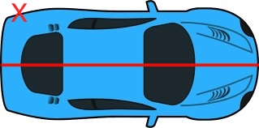

# Agenda

-   Intro - 5 min

-   Philosophy (lecture style) - 15 min

-   Cover ways to improve code organization at each of 3 levels (25 min each - Total 1h15)

    -   Description and Tips (5 min)

    -   Look at "telephone" example as a group (10 min)

    -   Work through "shapes" example (10 min)

-   Finish up working through shapes example (20 min)

-   Wrap up (10 min)

# Philosophy

## Code as Scientific Communication

Code is written for humans to understand. Yes, the computer needs to understand the code too, but there are many many ways to tell the computer what to do. We should chose one that is as easy as possible for other humans to understand the instructions that we give to the computer. Fortunately, "high level" programming languages like R and python are designed to be especially human-friendly.

Like with good writing:

-   Pragmatism over dogma
    -   there is no "one right way"
    -   some ways are more and less effective
    -   it is possible to express something completely different from what you intend to
-   Different situations call for different styles
    -   less formal: writing personal notes, texting a friend, creating a proof of concept, trying out package for the first time
    -   more formal: publications, talks, packages that you want others to use
    -   efficient, but unapproachable: air traffic controllers, low-level code (not covered in this tutorial)
-   It can be helpful to decide (and write down) what you plan to communicate before you start drafting.

Don't let the perfect be the enemy of the good.

## Using Modularity to Manage Cognitive Load

### Typical Process for Creating THEREALLYLONGSCRIPTtm

🙋 Who has ever writing a script that is 100s or 1000s of lines long? In that script, even when you were deep in it, could you tell exactly what every variable at every stage was doing?

One long unyielding script is a bit like a wall of text with no headings or paragraphs breaks.

+------------------------+----------------------------------------------------+
| When you're working on | What you're holding in your mind                   |
+========================+====================================================+
| Part A                 | -   Everything from Part A                         |
+------------------------+----------------------------------------------------+
| Part B                 | -   A few things from Part A that are needed for B |
|                        |                                                    |
|                        | -   Everything from Part B                         |
+------------------------+----------------------------------------------------+
| Part C                 | -   A few things from Part B                       |
|                        |                                                    |
|                        | -   Maybe some thing needed from Part A            |
|                        |                                                    |
|                        | -   Everything needed for Part C                   |
+------------------------+----------------------------------------------------+

One of the things that's hard about coming back to THEREALLYLONGSCRIPTtm is that you might not remember which things are important to hold onto in your mind.

Modularity formalizes this process. When you making A into a function separate script or especially a function, you make clear what the inputs and outputs. Therefore, you know only the outputs are used further down.

### User vs Maintainer (We contain multitudes.)

User cares about the inputs and outputs of a function, but will almost never look inside. Maintainer is responsible for making the function do what it's supposed to do so they need know the internals of a particular function or module.

One way to think of it is that there are multiple versions of yourself. Let's say Abbie is the maintainer of part A, and Britta is the maintainer of part B (but really both are you). Britta is also a user of part A. Britta only cares about the outputs from A, not about the details. It's Abbie's job to make it as easy as possible for Britta to understand what part A does without worrying about exactly how.

### Other Benefits of Modularity

-   Easier to reuse
-   Easier to test (come back next week for how!)
-   Easier to break up work among collaborators (covered in 16 April workshop)

## Design Process

Not every way to break down a bigger problem into smaller ones is effective.




## Documentation

Consider your audience and the purpose of the documentation.

-   Design Doc
-   User-facing documentation
    -   README
    -   Help pages for externally facing functions
-   Maintainer-facing documentation
    -   Help pages for internal functions
    -   Code comments
        -   Should clarify decisions made
        -   Explain things not evident in the code

If you only do one, thinking about the interfaces between components (e.g. function, argument, returns) and writing user-facing docs for those interfaces is probably the best.

# Levels of Organization

## High Level: Big Picture Structure

This is like pre-writing

When you're embarking on a larger project, it helps to think about how you might break it down into components. You can use some of the same techniques that you would use for piece of writing: mind map, outlining, etc. Another useful tool is pseudo code - writing out some hypothetical functions in inputs and outputs and a rough outline of what it would do mixing together code-like structures and regular writing.

As you settle on a structure, some things to think about:

-   when you do one "run" of this process, what is the execution order ie what bits of code will run in what order?

-   what are in inputs and outputs of each component?

-   which pieces will you want to re-run without running the whole pipeline?

Example data pipeline:

```         
1) Data Cleaning (a->b->c)
  a) Put in common file format: Move everything from excel format into csv with consisent column names (even if contents are a bit messy).
  b) Fix inaccurate entries:
    i) For all columns where contents need to be from fixed set of values, update so they are within those allowed values.
    ii) For all numeric columns, make sure they are numbers and they are in range.
2) Modeling
  a) Load source data and select columns
  b) Build derived columns (e.g. indicators)
  c) Run and save model.
3) Data visualization
  a) Load source data and select columns
  b) Load model data
  c) Plot source data alone
  d) Plot model alone
  e) Plot model and source data together
```

You'll notice 2a and 3a are the same so perhaps you would want to write a function for that data selection that can be loaded into your modeling module and your visualization module. Likewise, 3e might be calling 3c and 3d in sequence and applying them to the same plot.

In crafting this design, you are trying to break down your process into human-understandable pieces. This is similar to how a paper with good headings and subheadings is easier to read than a wall of text. You can visualize what your eventual "run full analysis" file will look like. Something like:

``` r
source('01_clean_my_data.R')

source('02_run_models.R')

source('03_visualize.R')
```

``` python
from myproject import clean
from myproject import model
from myproject import visualize

clean.run_all()
model.run_all()
visualize.run_all()
```

Within each of these functions, scripts, or sub-modules, you then would have a function for each sub-bullet. (Ideally, each step will take as an input the output of the previous step.)

ℹ️ **Getting Design Feedback** Often, folks will write up the design for their software project. This is a great spot to get feedback. A "design doc" can have include the goal of your project,what you plan to do, how you plan to modularize the process, high level outcomes you hope to achieve, as well as alternative designs that you considered.

### Documenting High Level

README.md for your project should explain the overall goal, what the components are, and how they fit together.

Consider putting all your functions together as a package. Further reading [python](https://packaging.python.org/en/latest/tutorials/packaging-projects/) and [R](https://tinyheero.github.io/jekyll/update/2015/07/26/making-your-first-R-package.html) , [another R resource](https://devguide.ropensci.org/pkg_building.html)

### ✍️ Full Group Activity: Design a "Telephone Game" simulation

> Players form a line or circle, and the first player comes up with a message and whispers it to the ear of the second person in the line. The second player repeats the message to the third player, and so on. When the last player is reached, they announce the message they just heard, to the entire group. The first person then compares the original message with the final version. Although the objective is to pass around the message without it becoming garbled along the way, part of the enjoyment is that, regardless, this usually ends up happening. Errors typically accumulate in the retellings, so the statement announced by the last player differs significantly from that of the first player, usually with amusing or humorous effect. Reasons for changes include anxiousness or impatience, erroneous corrections, or the difficult-to-understand mechanism of whispering.

[Wikipedia](https://en.wikipedia.org/wiki/Chinese_whispers)

You want to build a program that simulates this game to look at questions like: How often does is the word transmitted successfully? How often is the final word similar to the starting word? What factors impact the reliability of transmission and to what degree?

What would be the major components? How would they interact with each other?

This is not a coding exercise, just a design exercise. The output should be some combination of outline, diagram, and/or pseudocode.

### ✍️ Small Group Activity: Redesign shapes.py, shapes.R

Take a look at the intentionally poorly written shapes scripts provided. Sketch out how you could break down this process into different functions, and how they would interact with each other.

## Middle Level of Abstraction: Functions (and Objects)

Once you're within module or big section of your code, you can use functions to break it up into smaller pieces.

### Step 0: Do you even need to write this code?

Some reason you might not have to:

-   Someone else has implemented this functionality and you can use their package.

-   You are only doing this thing in one place in your code. You can keep your code DRY without creating a separate function.

    -   In this case, you may still want to write a function to name what you're doing or for test ability, but it should be very simple.

Some Principles

-   DRY - Do not repeat yourself
-   YNGNI/KISS - You're not going to need it, Keep it simple.

### Step 1: Design from Function User's Perspective

The user of the function needs to know *what* it does, but not *how*. You can write down the *what* before implementing the *how*.

-   Document the what

    -   Name

    -   Arguments

        -   **Avoid surprising users with implicit arguments**

    -   Functionality

        -   **Plan for the user who are naive to your function**

#### Design by Documenting

-   Write a simple usage example.

    -   🤫 Psst! This can later be turned into tests. More on that next week.

-   Write a quick text description of what it should do.

    -   If the function name says most of it, and you just need to add a little context, good job!

    -   If you find yourself having to restate every line of your function in the description, you may consider choosing to break up your code differently.

#### ✍️ Example: roxygen/Docstring for "Similar Word" function (Telephone Simulation)

``` python
def similar_word(word, lang):
    '''Returns a common word with a short Levenstein distance to input word
    
    Non-deterministically returns a word within the 10,000 most common words in the input language. More common words are more likely to be chosen. Words with shorter Levenstein distance to input word are more likely to be chosen.
    
    Parameters
    ----------
    word: str
      Target string to return a word close to. Does not have to be a valid word in the target language.
    lang: str
      The BCP 47 or ISO 639 code of the target language.
    
    Returns
    -------
    str
      a valid word in the target language that is likely similar to the target word.
      
    Examples
    --------
    >>> similar_word('stop', 'en')
    'top'
    >>> similar_word('stop', 'fr')
    'trop'
    '''
```

Above is a numpy style docstring. [Official python documentation](https://peps.python.org/pep-0257/) is not opinionated about how to document arguments. There are [several conventions](https://note.nkmk.me/en/python-docstring/#docstring-formats-and-example) to chose from in python.

``` r
#' Similar Word
#' 
#' Returns a common word with a short Levenstein distance to input word
#'
#' @param word character Target to return a word close to. Does not have to be a valid word in the target language.
#' @param lang character The BCP 47 or ISO 639 code of the target language.
#' @returns character a valid word in the target language that is likely similar to the target word.
#' @details
#' Non-deterministically returns a word within the 10,000 most common words in the input language. More common words are more likely to be chosen. Words with shorter Levenstein distance to input word are more likely to be chosen.
#' @examples
#' similar_word('stop', 'en')
#' similar_word('stop', 'fr')
similar_word <- function(word, lang){
...
}
```

Both examples informed by [wordfreq](https://github.com/rspeer/wordfreq/).

#### Avoid Surprising Users

-   Only explicit inputs to the function should change the output

    -   Keep your workspace clean to avoid inadvertently using leftovers from other processes

    -   Avoid using global variables. If you do use them, make it very clear which variable are global and when they get set or updated.

``` r
# BAD
total <- 0
add_to_running_total <- function(number){
  total <<- total + number
}

add_to_running_total(8)
add_to_running_total(10)

print(total)

# GOOD
add_to_running_total <- function(number, running_total){
  return(number + running_total)
}

total <- add_to_running_total(8, 0)
total <- add_to_running_total(10, total)

print(total)
```

``` python
# BAD
total = 0
def add_to_running_total(number):
    global total
    total = total + number

add_to_running_total(8)
add_to_running_total(10)

print(total)

# GOOD
def add_to_running_total(number, running_total):
  return(number + running_total)

total = add_to_running_total(8, 0)
total = add_to_running_total(10, total)

print(total)
```

When you have a variable with global scope that gets modified (or other implicit behavior), that's a extra thing for the reader to keep track of throughout the *whole* program. We want the reader to be able to user that mental slot for something else.

-   If the user sends you the wrong input, fail in a way that helps them fix it.

``` r
similar_word <- function(word, lang){
  if(length(word) == 0) stop('word must be at least one character long')
  ...
}
```

``` python
def similar_word(word, lang):
  assert len(word) > 0, 'word must be at least one character long'
  ...
```

#### ✍️ Small group : roxygen/Docstring for shapes

Write the signature (name, arguments) and documentation for a function for each process you identified in shapes.

You do not need to implement these functions (yet!)

ℹ️ **Write Reusable Tests** This is the point where you can write formal reusable tests to make sure you code is doing what you want. More details next week!

### Function Maintainer's Perspective

Once you know the *what*, then you can focus on the *how*. Here, you want to make the implementation as simple as possible. If you can write code in such a way that comments are not needed to explain what's going on, that's a good sign. If you have a good reason to have a more complex or hard to grasp implementation, add comments to bridge the gap.

# 

### Naming Things

"There are only two hard things in Computer Science: cache invalidation, naming things, and off by one errors" (Derived from Phil Karlton quote.)

**Variable and function names should be meaningful.** Similar to how we want our major sections to have human-interprable meaning, we also want our

-   typically, functions should involve a verb (e.g. count), non-functions should be a noun (e.g. counter)

    -   [rOpenSci](https://devguide.ropensci.org/pkg_building.html) recommends object_verb() for functions (e.g. stri_join), verb_object is another common convention (e.g. get_data). Good to chose one and be consistent.

-   naming something a single letter communicates 'I'm not not important' [ref: [CodeAesthetic](https://www.youtube.com/watch?v=-J3wNP6u5YU)]

-   avoid abbreviations [ref: [CodeAesthetic](https://www.youtube.com/watch?v=-J3wNP6u5YU)] but if you must abbreviate, use abbreviations consistently

Some specific cases:

-   consider what list/vector/vectors you're iterating over when you write for loop

#### ✍️ Example

``` r
## BAD
r <- function(p)
  rbinom(1, p, .8) == p

np <- 7:10
ns <- 25

df <- data.frame(i = numeric(0), n = numeric(0), r = logical(0))

for (i in 1:ns) {
  for (n in np) {
    df[nrow(df) + 1, ]  <- c(i, n, r(n))
  }
}

## Better
run_simulation <- r

player_counts <- 7:10
sims_per_player_count <- 25

results_df <-
  data.frame(sim_idx = numeric(0),
             n_players = numeric(0),
             result = logical(0))

for (index in 1:sims_per_player_count) {
  for (player_count in player_counts) {
    # add a row with each simulation
    results_df[nrow(results_df) + 1, ]  <-
      c(index, player_count, run_simulation(player_count))
  }
}
```

``` python
from random import choice

## BAD
def r(p):
    return all([choice([True]*8 + [False]*2) for i in range(p)]) 

np = range(6, 10)
ns = 25

rl = []

for i in range(ns): 
    for n in np:
        rl.append({
         'i': i,
         'n': n,
         'rd': r(n)
        })

## Better 
run_simulation = r

player_counts = range(6, 10)
sims_per_player_count = 25

all_sim_results = []

for idx in range(sims_per_player_count): 
    for player_count in player_counts:
        all_sim_results.append({
         'index': idx,
         'n_players': player_count,
         'result': run_simulation(player_count)
        }
```

# Granular Level: Coding Style

### Consistent Formatting

Both R and python offer a lot of flexibility in spacing and syntax. For readability, it's helpful to make these choices in a consistent way. This is analogous to grammar and punctuation in a piece of writing.

``` r
## BAD
m=   .5;x<-1.          :10;b=8
y        <-  m     *x+    b

## BETTER
m <- .5
x <- 1:10
b <- 8
y <-  m * x + b
```

``` python
## BAD
m=   .5;x=range(1,
                
                
                
11);b=8
y =  [
m        *xi+           b
         for
xi
in 
         x]

## BETTER
m = .5
x = range(1, 11)
b = 8
y =  [m * xi + b for xi in x]
```

-   Coding style guides - human readable styling standards

    -   Python: [PEP8](https://peps.python.org/pep-0008/), [black style guide](https://black.readthedocs.io/en/stable/the_black_code_style/current_style.html)

    -   R: [tidyverse style guide](https://style.tidyverse.org/)

-   Checkers - automatically see if standards are met

    -   python: [pylint](https://pylint.readthedocs.io/en/latest/), [black](https://black.readthedocs.io/en/stable/index.html), [pycodestyle](https://github.com/PyCQA/pycodestyle)

    -   R: [lintr](https://lintr.r-lib.org/)

-   Auto formatters - edits your code to conform to style guide

    -   python: [black](https://black.readthedocs.io/en/stable/), [autopep8](https://github.com/hhatto/autopep8)

    -   R: [formatR](https://yihui.org/formatr/), [styler](https://styler.r-lib.org/),

Not that some of the python tools default to different style guides, and therefore will conflict with each other. Recommend adding one at a time so you can tell if this occurs and configure them to match. [Black doc on how to avoid conflicts.](https://black.readthedocs.io/en/stable/guides/using_black_with_other_tools.html)

#### ✍️ Small group : Implement the functions for shapes

# Wrap up

## How to check if your code is readable? Ask someone to read your code

-   Post your final shapes script to the mattermost channel.

## Magical Refactoring Helpers Exist

..and are often built into an IDE or extension.

-   RStudio under the magic wand menu

-   VSCode's python extension right click on the variable you want to change.

-   "rope" library in python is very powerful for refactorings and can be used with a vim extension

## Extras for Python Users

### Pythonic Idioms

There are a bunch of special features [python idioms](https://docs.python-guide.org/writing/style/#idioms) as you use these, keep in mind the goal of readability. Idiomatic python is often more compact and more readable, but not always.

### Type Hinting

[Intro Guide](https://dagster.io/blog/python-type-hinting)

[Design Doc](https://peps.python.org/pep-0484/)

[Official Docs Reference](https://docs.python.org/3/library/typing.html)

More resources:

[Mozilla Code Review Guidelines](https://mozillascience.github.io/codeReview/review.html)
