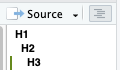

# Setup

-   Clone repo or pull latest changes

-   Set working directory to `20241112-project-structure`

-   Install requirements

    ```         
    # Packages needed to use these methodes in your project
    install.packages(c('devtools', 'validate', 'targets', 'tinytest', 'pkgKitten'))

    # Packages needed for example script only
    install.packages(c("coda","mvtnorm","loo","dagitty", "dplyr", "RColorBrewer","lubridate"))
    install.packages("cmdstanr", repos = c('https://stan-dev.r-universe.dev', getOption("repos")))
    devtools::install_github("rmcelreath/rethinking")
    ```

# Intro

-   A lot of this is my own workflow/opinion, with some general principles mixed in. Please take what works for you and leave what doesn't behind.
-   Example is generously donated by Brendan from here: <https://github.com/bjbarrett/long_spatial_data_enso_lomas> The script in the example is scripts `01_` and `02_` from that repo put together. For the modeling section, I saved the models and modified the script to pull saved models instead of running STAN so participants don't need to install STAN, and the workshop will run faster.
-   This workshop is cooking-demo style. Meaning, it's not designed for you to be able to follow along modifying the code at the speed of the workshop. Implications:
    -   *I beg you, please tell me if you don't understand what's going on*. There are not many exercises, so I won't be able to gauge your understanding that way. It's a waste of everyone's time to move forward if everyone is lost so please please please stop me if I jump forward without sufficient explanation of what happened.
    -   Please set aside \~2hrs within the next couple weeks after the workshop to practice actually using the tools you're interested on your project. (Set a specific time for yourself.) At the end of the workshop, I expect everyone to understand what the different tools are, what they're used for, and roughly how they work. You will not get the practical ability to use them in the future by just listening today. That requires testing it out yourself. The best time is when the theoretical knowledge is fresh in your mind, and I am around to help.

# Non-Code (data) Project Organization

## Tips

-   **Non-code project organization** Separate folders for:
    -   inputs, in this case called `data`
    -   code
        -   in this case multiple folders: `01-just-a-script`, `02-script-with-functions` etc.
        -   in general if you have a "R code" folder inside your project, you should name it `R`
    -   intermediates, in this case `saved-models`
    -   outputs, in this case `plots` . Could be broken up into separate "plots" and "results" folder, as recommended [here](#0).
-   **Working on EAS rstudio server**
    -   data folder should be on the data server (`EAS_shared`, `EAS_ind`, or `EAS_home`)
    -   code should *not* be on the data server, should be under source control (git)
    -   intermediates and outputs: up to you
-   **Avoiding committing your data** (unless it's small and you're sure you want to). If you have your `/data` folder inside your rstudio project folder and thus inside your git repo, but you don't want to actually track changes and push to github. Then, you can add `data` (or whatever the name of your data folder is) to the `.gitignore` file.
-   **Define paths once** Define each relevant folder (in this case, maybe just code and data folders) at the beginning of the script. Then use `file.path(...)` to put together the path (folder) and the filename like `file.path(DATA_FOLDER, 'my_data.csv')`. (`file.path('~', 'my-project', 'data', 'my-data.csv')` will result in `'~/my-project/data/my-data.csv'` on Linux/Mac and `'~\my-project\data\my-data.csv'` on Windows so it's safer than using `paste` for the same purpose.)

## Generic example

```         
/your-analysis
|- .gitignore
|- my-script.R
|- results/  
|- data/ <- needs to be backed up with some method besides git
  |- some_data.csv
  |- more_data.csv
```

In `.gitignore`

```         
# Automatically added
.Rproj.user
.Rhistory
.RData
.Ruserdata
*.Rproj
.Rapp.history

# Manually Added
data
```

In `my-script.R`:

```         
INPUT_DIR <- './data'
OUTPUT_DIR <- './results'
```

## EAS example #1

#### Data Server + RStudio Server Workflow

```         
DATA SERVER
EAS_shared/YOUR_SPECIES/working/rawdata/your-field-season/
|- some_data.csv
|- more_data.csv

EAS_ind/YOU_USERNAME/your-analysis-results/
|- processed_data/
|- plots/
|- text-ouputs/

RSTUDIO SERVER
/home/top/YOUR_USERNAME
|- your-analysis <- root of git repo
    |- your_code.R
    |- another_script.R
```

In the code

```{r}
INPUT_DIR <- '~/EAS_shared/YOUR_SPECIES/working/rawdata/your-field-season/'
OUTPUT_DIR <- '~/EAS_ind/YOU_USERNAME/your-analysis-results/'
source('./another_script.R')
read.csv(file.path(INPUT_DIR, 'some_data.csv'))
...
write.csv(file.path(OUTPUT_DIR, 'processed_data', 'cleaned_data.csv'))
```

#### Local Workflow

```         
/home/YOUR_USERNAME/
|- YOUR_SPECIES/working/rawdata/your-field-season <- synced with filezilla
    |- some_data.csv
    |- more_data.csv
|- your-analysis-results <- synced with filezilla
    |- processed_data/
    |- plots/
    |- text-ouputs/
|- your-analysis <- synced with git
    |- your_code.R
    |- another_script.R
```

```{r}
# changed
INPUT_DIR <- '~/YOUR_SPECIES/working/rawdata/your-field-season/'
OUTPUT_DIR <- '~/your-analysis-results/'

# not changed
source('./another_script.R')
read.csv(file.path(INPUT_DIR, 'some_data.csv'))
...
write.csv(file.path(OUTPUT_DIR, 'processed_data', 'cleaned_data.csv'))
```

#### How to avoid changing 2 lines of code

In your .Rprofile on the rstudio server:

```         
EAS_SHARED_PATH <- '~/EAS_shared'
EAS_INV_PATH <- '~/EAS_ind'
```

In your .Rprofile locally:

```         
EAS_SHARED_PATH <- '~'
EAS_IND_PATH <- '~/..'
# ^ (only works if your username is the same on your local machine)
# otherwise, you'll need to slightly change your local folder structure above
```

R script:

```{r}
# changed
INPUT_DIR <- file.path(EAS_SHARED_PATH, 'YOUR_SPECIES/working/rawdata/your-field-season/')
OUTPUT_DIR <- file.path(EAS_IND_PATH, 'your-analysis-results/')
```

Once you get to the point of publishing your code beyond EAS audience, you will want to let the user chose what path they've put their (or your) data in. This will hopefully come after setting up your code into functions.

## EAS example #2

```         
DATA SERVER
EAS_shared/YOUR_SPECIES/working/rawdata/your-field-season/
|- some_data.csv
|- more_data.csv

RSTUDIO SERVER
/home/top/YOUR_USERNAME
|- your-analysis <- root of git repo
    |- .gitignore
    |- your_code.R
    |- another_script.R
    |- / -data> /mnt/EAS_shared/YOUR_SPECIES/working/rawdata/your-field-season/
            ^ This is a symlink. How to create it is not covered in this tutorial, CLI is easiest.
YOUR WORKSTATION
/home/YOUR_USERNAME/
|- your-analysis <- synced with git
    |- your_code.R
    |- another_script.R
    |- data/ <- synced with filezilla
    |- results
```

In `.gitignore`

```         
# Automatically added
.Rproj.user
.Rhistory
.RData
.Ruserdata
*.Rproj
.Rapp.history

# Manually Added
data
```

In `my-script.R`:

```         
INPUT_DIR <- './data'
OUTPUT_DIR <- './results'
```

# Stages of Code Organization

## Stage 1: Just a script

### 🛠️ [Code Sections](https://support.posit.co/hc/en-us/articles/200484568-Code-Folding-and-Sections-in-the-RStudio-IDE)

Adding at least 4 `#`, `-`, or `=` to the end of the comment makes it a section heading. The number of `#` at the beginning determines the "level". For example:

```         

# H1 ####

## H2 ####

### H3 ####
```

Results in:\


(Also works to add to outline in Positron/VSCode.)

✍️ Try creating a meaningful out line of `20241112-project-structure/01-just-a-script/spatial_enso_lomas_orig.R`

### 🛠️ `validate` package

In the previous, session we learned how to validate that your **code** is doing what you expect. However, this is different from checking whether your **data** is how you expect it. Even when you start your project and run things to see if it's "working" it's good to start making the distinction in your mind between these two concepts. You can start adding in `tinytest` calls to save your tests of code and `validate` calls to check your data.

[Lots of examples here](https://cran.r-project.org/web/packages/validate/vignettes/cookbook.html)

✍️ Try adding some more input validations to the example script

### 🛠️ renv

Used to keep track of which versions of which packages you used for better reproducibility. Details not covered in this tutorial, but worth checking out.

<https://rstudio.github.io/renv/articles/renv.html>

## Stage 2: Script with functions

### Problems it solves

I keep copying and pasting the same code in multiple places in my script. Then if I want to modify it, I have to do find and replace which doesn't always work.

My script is getting long enough that I have lots and lots of objects in my workspace and it's hard to remember what everything is. It's also hard to figure out what does or doesn't need to get re-run.

### How it looks

Everything is still in one script, but the script as two parts. At the top, you define all the functions you use (some might call each other). At the bottom, the "runner" section of the script calls a few of these functions to kick off the process.

**OK, but how does this even help?** Before if you wanted to run only part of your script, either you highlight that part and try to be careful to highlight the same portion each time, or you comment out big sections. Now, when you're only working on one section, you can just comment out the other parts in the "runner" section. Then when you run the whole script, the functions for those sections will still be defined, but not run. Likewise with plotting or anything you might want to run or not run.

### Tips

-   **Strategy to Transition -** Options:
    -   Bottom up: start with small pieces of repeated code, make functions for those
    -   Top down: start by making one big function that you call at the end.
-   **Avoiding Breakage**
    -   You need a way to check that the final output of your script is unchanged.
    -   Having `validate` and `tinytest` checks sprinkled in will help detect problems before the end.
-   **Organizing data validation and software testing**
    -   Consider putting your data validation (`validate` calls) in their own functions, one for each datasource.
    -   Software tests (tests that your functions are doing what they're supposed to) can go after your function definitions but before your runner code.
-   **Start Documenting Now**
-   **`checkmate`** Package is designed to help you check within each function if the inputs are of the correct format.
-   **Debugging Tools** This is a good stage to start testing out [Formal Debugging Tools](https://adv-r.hadley.nz/debugging.html)
    -   `browser`
    -   `traceback` start to be useful here
    -   breakpoints
-   **`list` + `do.call`** to pragmatically generate the arguments you want to use for a function. Usually in the end, this isn't the most clear, but it can be helpful in the refactoring process.
-   **Don't "hardcode" paths inside functions** If the purpose of the function is to load data, pass the path in as an argument. If the function has some other purpose, make the data itself an argument.

### Debugging Demo

## Stage 3: Three File Workflow

### Problems it solves

When I'm writing my code, I do a lot of running and rerunning with a small part. It's hard to keep track of which code is left over from this process and which is part of my "real" script.

My tests are taking too long to run. I want to run them separately from the main code.

### How to transition

-   (optional) I usually rename my original file to end with `_lib.R` for library. This `_lib.R` file only defines functions and does not run them.

-   Create a new file (I usually call it `runner.R`) and move all the parts of the code that are actually running code into that file. Source the `_lib.R` file at the beginning of your runner file.

-   Create a new file for tests. Like the runner, this should source the `_lib.R` . Unlike the runner, this does not run your whole workflow. Instead, it runs the functions with known inputs (sometimes multiple times) and checks that the outputs are correct.

### Tips

-   For software testing, it often makes sense to first focus on data processing functions (both before and after modeling) since they tend to have the complex handwritten logic, knowable outputs.

-   Sourcing your `_lib.R` file should take almost no time. If it's taking a long time, it probably means you haven't actually encapsulated everything into a function. In this case, either put a function around the unencapsulated logic, or move that logic to the runner file.

-   Sometimes it's nice to make your runner file as short as possible to avoid introducing bugs in untested code. (The runner code is by definition not subject to the tests in the tests file). To do this, you can make one big function that basically means "run the whole thing". Convention is to call this function `main`. Then your runner.R will be only 2 lines: `source('myproj_lib.R'); main()` . Or you still may want to make the data paths arguments of main.

-   I also sometimes create a 4th file that's just "playing around" and call it something like `scratch.R`. I will use that debug or build up logic, but then when I'm done make sure all the "good" logic gets put back into one of the other three files.

### 🛠️ Rmarkdown

If you want to mix together text and code, you can use an Rmarkdown document in place of `runner.R`

## Stage 4: Targets Workflow

### Problems it solves

My file with functions is getting really long. I want to break it into separate scripts, but then, I'd have to add "source()" everywhere.

I keep having to comment and uncomment things in my runner script, especially the parts that are taking a long time. Even with fewer variables to keep track of, it's still kind of hard to remember what needs to be refreshed.

### How to transition

-   Move `_lib` script into a folder called `R`
-   Convert runner script into a \_targets.R [Example here](https://books.ropensci.org/targets/walkthrough.html)
-   Any functions that generate plots, you need to either save the plot an object (ggplot) or file [More Details Here](https://raps-with-r.dev/targets.html#a-pipeline-is-a-composition-of-pure-functions)
-   Any functions that print important things (usually validation files) need to return the output or write to file. (If a function you're calling prints what you need instead of returning it, you `capture.output` to actually return what was printed.)

### Tips

-   There are specific stan/brms related targets templates. If you're using one of these packages, be sure to check those out.

-   The way the `targets` package avoids re-running things is by storing (caching) copies of all the targets you define in a directory in your working directory called `_targets`. This can sometimes have unintended consequences. Two main ones to keep in mind:

    -   If you are working with larger data, this could use a lot of storage space.

    -   If your working directory (and thus your caching directory) is on the EAS data server, this will really slow your workflow down because the EAS data server is not optimized for reading and writing lots of tiny files like this.

-   Targets has functionality that lets you run your code remotely, so if/when we grow beyond the rstudio server, this will be useful to make it easier to use High Performance Computers from R.

### Handy Lines

```         

tar_make(script = '04-targets/_targets.R')
tar_visnetwork(script = '04-targets/_targets.R')

tar_objects()
tar_load('mei_data')
tar_load('group_validation')
plot(group_validation)

tar_load_everything()
```

## Stage 5: Package (plus runner or targets)

### Problems it Solves

You want to use the same functions across multiple projects. You want to let other easily run your functions. You want your help pages to show up in the "help" window. You want a quick way to source all the files in your `R` directory without targets.

### How to transition

From **either** stage 3 or stage 4,

-   **Create package skeleton** `pkgKitten::kitten(name=YOUR_PACKAGE_NAME)`.

-   **Add your functions** Move your \_lib.R file from stage 3 into the newly created R folder OR replace the newly created R folder with your R folder from stage 4.

-   **Add your tests** Move your tests.R file into `inst/tinytest` (if you want to use testthat, delete inst and tests folders and then follow testthat setup instructions). Remove any `source` or working directory things from that file.

-   **Include your runner** There are several options:

    -   The simplest option is to include in the git repo, but not the package, put it on the same level as DESCRIPTION. (This often makes the most sense for `_target.R`)

    -   To include it with the package without modification, put it in the `inst` folder.

    -   To make have it as a nice example to future users of your package, you can convert it into a vignette. To do this, you will need to include sample data.

-   (opt) **Add sample data** This is if you want to publish some of your data as part of your package so that your users can easily access it without worrying about loading files. This will work similar to how `iris` and `mtcars` work in in base R. This is only appropriate for small data sets. [Full instructions here](https://r-pkgs.org/data.html)

### Tips

If your purpose in creating a package is for your own organization, you can simply transplant what you've done in the previous stages into a package. If you hope to actually make it usable by others, you will want some time thinking about who your users are, what they want, and how you can modify the design of your functions to be most useful and easy to understand for them. That's beyond the scope of this tutorial, but there are many resources on this topic.

### Handy Lines

```         

devtools::load_all('05-package')
tinytest::run_test_dir('05-package/inst/tinytest/')

tar_make(script = '05-package/_targets.R')

devtools::document('05-package')
?load_group_homerange_data
```
