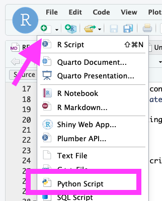
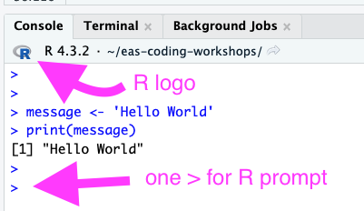
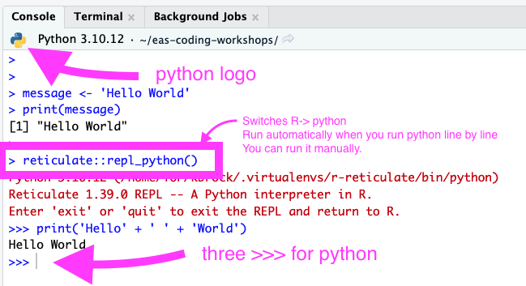
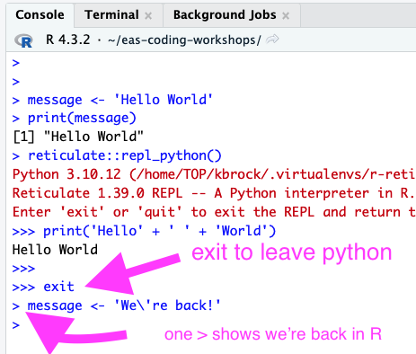

# Intro

## Scope

Priorities: Get intermediate R users comfortable writing and running python code.

Not completely covered:

-   Everything you need to do a project in python. (Outline of getting from here to there provided at the end.)

-   Setting up your working environment to optimize for python.

## Setup

(Only tested on RStudio Server.)

-   Install `reticulate`

```{r}
install.packages('reticulate')
```

-   Set up python
    -   Check if python is installed and configured already by running `reticulate::py_available()`
        -   If you get `Would you like to create a default Python environment for the reticulate package?`
            -   type `Yes`
            -   then you're done
        -   If you get `TRUE` you're done!
        -   If you get `FALSE` continue.
-   Install python `reticulate::install_python()`

TODO: Make sure not breaking license.

## Getting Started

Create a new python script

{width="181"}

Add this line to it:

```         
print('Hello' + ' ' + 'World')
```

Run line by line with `Ctrl+Enter` or `Cmd+Enter`. (If you are seeing "non-numeric argument to binary operator" that means you're running the above in R console.)

You will notice this automatically runs `reticulate::repl_python()` to switch the prompt from R to python.

{width="216"}

{width="330"}

{width="233"}

You can also manually run

`reticulate::repl_python()` to switch R ➡️ python

`exit` to switch python ➡️ R.

# CAC Workshop Materials

<https://cvw.cac.cornell.edu/python-intro/data-operations/index>

-   *skip* Overview. (Replaced with Setup/Getting Started above)

-   Data and Operations

    -   Walk through all 4 sections

    -   🧑‍🏫 Getting cozy with python

-   Input/Output

    -   Screen I/O

    -   ✍️Mini exercise

    -   String formatting

    -   *skipping* File I/O

        -   Covers Reading and Writing Files

        -   Note: `~` is not automatically resolved to your home directory in python so something like `open('~/my-project/my_file.csv')` will *not* work. You will need to run `import os` and then use something like `open(os.path.expanduser('~/my-project/my_file.csv'))` .

    -   *skipping* Serialization - Equivalent of RDS

-   Control Flow

    -   Conditionals ✍️

    -   For loops ✍️

-   Objects

    -   Lists ✍️

    -   Tuples, Dictionaries Sets

    -   🧑‍🏫 R lists vs Python list/dictionary, list comprehension

-   Working with modules

# Getting from Here to your First Project

-   Complete tutorial sections on File I/O and Working with Modules

-   Set up python virtual environment and start installing packages. I recommend not starting by installling `numpy` because that can sometimes have issues that other packages don't have. Maybe start with [art](https://github.com/sepandhaghighi/art).

-   Option 1) Use reticulate <https://rstudio.github.io/reticulate/articles/python_packages.html#python-environments>.

    -   You only need to go through the first 3 sections *not* the conda or shell sections.
    -   If you're starting with `art`, run `reticulate::virtualenv_install(packages = 'art')`.

-   Option 2) Use command line (python standard way) <https://packaging.python.org/en/latest/tutorials/installing-packages/>

    -   Note: All the commands listed in this tutorial would be run in the `Terminal` tab, not `Console` tab (R or python).
    -   In `Terminal`, you your prompt should start with something like `(r-reticulate)`. That indicates you are in a virtual environment. If you don't have something in parens like that, follow the instructions for creating and a virtual environment.
    -   If you're installing `art`, run `pip install art`

-   Start with basic stats and data manipulation. This list is kind of equivalent to base R. There are more efficient data manipulation packages, prettier plotting packages, etc. This is a starting point.

    -   `numpy` module gives you data structures similar to R vectors, matrices, etc.

    -   `pandas` gives you data frames.

    -   `scikitlearn` gives you basic stats

    -   `matplotlib` gives you basic plotting

# Final Notes

-   Learning python even somewhat is helpful for industry.

-   Using ML libraries like pytorch and tensorflow is often a motivation to learn python, but these libraries themselves have a learning curve and can be tricky to install. If you want to use these or similar libraries:

    -   Do some basic data processing that you already know how to do in R and/or a "fun project" first to get the hang of python.

    -   Ask me for help with "how do I get this running?" If you have challenges. You are not the problem if you're having challenges.

    -   Have patience with yourself.
