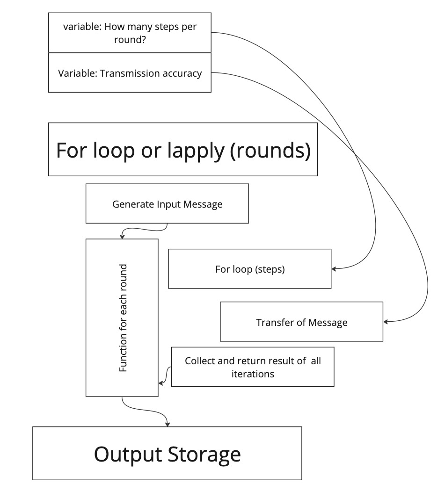

# Code Review Practices

- Library code review
  - Maintainable, reusable
- Scientific code review
  - pre-review
  - during review
  - post review

# Why?

Ensure errors in code do not result in incorrect findings in the scientific literature.

# What are we checking?
- Does code **R**un? [Ivmey-Cook]
- Are the results **R**eproducable?
    - "...ensuring that final outputs when code is rerun match those reported in the analysis and results sections (including any relevant figures and narrative text contained within these sections)." [Ivmey-Cook]
- **R**eadable [Added] <- Focus of this talk
    - Can you tell from reading the code what it is trying to do?
    - "How to write code other people can read"
- **R**eported [Ivmey-Cook]
 - Does what the code is trying to do match what's in the methods section of the paper?
- **R**eliable [Ivmey-Cook] <- Focus of this talk
    - Does the code actually do what it is trying to do?
    - "How to validate code as author and reviewer."
- **R**eusable [Added]
    - Can readers who want to reuse and extend the functionality easily do so?


EAS policy - first 4 gets an acknowledgement, reliable+ gets coauthorship


### Code as Scientific Communication

Code is written for humans to understand. Yes, the computer needs to understand the code too, but there are many many ways to tell the computer what to do. We should chose one that is as easy as possible for other humans to understand the instructions that we give to the computer. Fortunately, "high level" programming languages like R and python are designed to be especially human-friendly.

Like with good writing:

-   Pragmatism over dogma
    -   there is no "one right way"
    -   some ways are more and less effective
    -   it is possible to express something completely different from what you intend to
-   Different situations call for different styles
    -   less formal: writing personal notes, texting a friend, creating a proof of concept, trying out package for the first time
    -   more formal: publications, talks, packages that you want others to use
    -   efficient, but unapproachable: air traffic controllers, low-level code (not covered in this tutorial)
-   It can be helpful to decide (and write down) what you plan to communicate before you start drafting.

Don't let the perfect be the enemy of the good.


# Run

This section is best **not** done in person. The readers of your publication will not have the benefit of an in person workshop with the author.

## As the reviewer...

Follow the instructions in the README to install and run the code. If this fails, likely modifications to the README are needed.

## As author...

- Include instructions of how to get the code running.
- Validate your instructions on a "Fresh Environment" e.g by creating a new account on your computer.
- If your code has a long-running portion, ensure there is a way to 
  - For simulations, parameterize in such a way that a smaller version can be run.
  - For models, store the model inputs and outputs immediately before and after each long-running step. 
- Specify versions of dependencies that you've tested
  - Tools
    - Python packages - [poetry](https://github.com/python-poetry/poetry) or similar
    - R packages - [renv](https://rstudio.github.io/renv/articles/renv.html)
    - System packages - [docker](https://www.docker.com/) or similar
  - Requiring vs Documenting
    - Requiring - allow users to newer minor versions and/or a version range where possible
    - Documenting - it's helpful to know the exact versions that actually worked in case 
        - Docker: image hash (on dockerhub)
        - Git: Commit hash
        - Python/pip: Minor version
        - R/CRAN: Date downloaded from CRAN

# Reproducable

## As reviewer...

Compare the outputs you have generated from running the code to the outputs scientist is using to draw their conclusions (eg in the manuscript).
For long running portions of code, there may be an un-rerunable section. This section should be kept as minimal as possible since they will only be visually reviewed.
Make sure you have a way to run the post-long running sections.

# Readable

## As reviewer...

You can evaluate readability by "was I able to read this code," but in order to give feedback that allows the author to improve, you will need to understand *how* one can make their code more readable. 

-  Philosophy: - 15 min
  -  Using Modularity to Manage Cognative Load
  -  Choices about modularity
  -  Documentation at each level
- Readable project/modules 15 min?
  - Outline/Prewriting
  - Project level documentation
- Readable objects/functions 15 min?
  - User-Maintainer paradigm in practice
  - Doc strings vs comments
- Readable Code: 15 min
  - Naming things 
  - Linting (Consistent formatting)
  - Pythonic idioms
  - Type hinting
- Extras: magic refactoring

## Break it up.. but why?

Using Modularity to Manage Cognitive Load

### Typical Process for Creating THEREALLYLONGSCRIPTtm

####

Who has ever writing a script that is 100s or 1000s of lines long? In that script, even when you were deep in it, could you tell exactly what every variable at every stage was doing?

####

Two questions
- How does the author create a working script without being able to keep track of all the variables in said script?
- How can the author incorperate the "extra information" needed to navigate the program into the code itself? ie Create a program that the reviewer can read and understand?

One long unyielding script is a bit like a wall of text with no headings or paragraphs breaks.

#### How the author vs reviewer understanding of THEREALLYLONGSCRIPTtm

In practice, we do 

| When you're working on | What the author is thinking about| What the reveiwer has to think about|
| ---------------------- | -------------------------------------------------- |---------|
| Part A                 | -   Everything from Part A                         |- Everything from Part A|
| Part B                 | -   A few things from Part A that are needed for B <br> -   Everything from Part B                         | - Everything from Part A that *might* be needed <br> - Everything from Part B|
| Part C                 | -   A few things from Part B <br> -   Maybe some thing needed from Part A <br> -   Everything needed for Part C                   | - Everything from Part A that might be needed <br> - Everything from Part B that might be needed - Everything from part C||

This also applies to (maybe even more) really huge class with lots of properties and methods that all interact with each other. 

####

Modularity formalizes this process. When you making Part A into a module or a function, you make clear what the inputs and outputs. Therefore, you know only the outputs are used further down.

#### User vs Maintainer (We contain multitudes.)

We have all been in the role of the *user* of any number of functions/packages. As a user, we care about the inputs and outputs of a function, but rarely look inside.

When we write our own code including functions and mudules, we are responsible for making each piece of the code do what it's supposed to do. As the *maintainer* of this code, we need know the internals of a particular function or module.

One way to think of yourself in different moments in time as the maintainer of some of your modules and the user of others. So while you're working on Part B, consider youself as the maintaienr of Part B and  user of Part A. Only worrying about the parts of A that are explicitly passed to B. When working on Part A, consider yourself just as the maintainer of Part A. Consider what your user, Mr. Maintainer-of-Part-B (your alter ego) would want to make Part A as easy for them to use as possible. 

### Documentation

Consider your audience and the purpose of the documentation.

-   Design Doc
-   User-facing documentation
    -   README
    -   Help pages for externally facing functions
-   Maintainer-facing documentation
    -   Help pages for internal functions
    -   Code comments
        -   Should clarify decisions made
        -   Explain things not evident in the code

If you only do one, thinking about the interfaces between components (e.g. function, argument, returns) and writing user-facing docs for those interfaces is probably the best.

### Other Benefits of Modularity

-   The author themselves will have an easier time understanding the code after they have lost context
-   Easier to break up work among collaborators 
-   Easier to test (useful for Reliability)
-   Easier to Reuse

## Break it up...but how?

Not every way to break down a bigger problem into smaller ones is effective.


### Reading Projects

#### As author...

Approach the high-level design of your program the same way you would approach the design of a large manuscript. 

When you're embarking on a larger project, it helps to think about how you might break it down into components. You can use some of the same techniques that you would use for piece of writing: mind map, outlining, etc. Another useful tool is pseudo code - writing out some hypothetical functions in inputs and outputs and a rough outline of what it would do mixing together code-like structures and regular writing.

#### Telephone example



As you settle on a structure, some things to think about:

-   when you do one "run" of this process, what is the execution order ie what bits of code will run in what order?

-   what are in inputs and outputs of each component?

-   which pieces will you want to re-run without running the whole pipeline?

Example data pipeline:

```         
1) Data Cleaning (a->b->c)
  a) Put in common file format: Move everything from excel format into csv with consisent column names (even if contents are a bit messy).
  b) Fix inaccurate entries:
    i) For all columns where contents need to be from fixed set of values, update so they are within those allowed values.
    ii) For all numeric columns, make sure they are numbers and they are in range.
2) Modeling
  a) Load source data and select columns
  b) Build derived columns (e.g. indicators)
  c) Run and save model.
3) Data visualization
  a) Load source data and select columns
  b) Load model data
  c) Plot source data alone
  d) Plot model alone
  e) Plot model and source data together
```

You'll notice 2a and 3a are the same so perhaps you would want to write a function for that data selection that can be loaded into your modeling module and your visualization module. Likewise, 3e might be calling 3c and 3d in sequence and applying them to the same plot.

In crafting this design, you are trying to break down your process into human-understandable pieces. This is similar to how a paper with good headings and subheadings is easier to read than a wall of text. You can visualize what your eventual "run full analysis" file will look like. Something like:

``` python
from myproject import clean
from myproject import model
from myproject import visualize

clean.run_all()
model.run_all()
visualize.run_all()
```

Within each of these functions, scripts, or sub-modules, you then would have a function for each sub-bullet. (Ideally, each step will take as an input the output of the previous step.)

ℹ️ **Getting Design Feedback** Often, folks will write up the design for their software project. This is a great spot to get feedback. A "design doc" can have include the goal of your project,what you plan to do, how you plan to modularize the process, high level outcomes you hope to achieve, as well as alternative designs that you considered.


###  Reading Less
 
As you look into a program, consider whether this code even needs to exist.

Some reason you might not have to:

-   Someone else has implemented this functionality and you can use their package.

-   You are only doing this thing in one place in your code. You can keep your code DRY without creating a separate function.

    -   In this case, you may still want to write a function to name what you're doing or for test ability, but it should be very simple.

Some Principles

-   DRY - Do not repeat yourself
-   YNGNI/KISS - You're not going to need it, Keep it simple.

### Reading functions/objects from the outside

The user of the function needs to know *what* it does, but not *how*. You can write down the *what* before implementing the *how*.

-   Document the what

    -   Name

    -   Arguments

        -   **Avoid surprising users with implicit arguments**

    -   Functionality

        -   **Plan for the user who are naive to your function**

#### Design by Documenting

-   Write a simple usage example.

    -   🤫 Psst! This can later be turned into tests. More on that next week.

-   Write a quick text description of what it should do.

    -   If the function name says most of it, and you just need to add a little context, good job!

    -   If you find yourself having to restate every line of your function in the description, you may consider choosing to break up your code differently.

#### ✍️ Example: roxygen/Docstring for "Similar Word" function (Telephone Simulation)

``` python
def similar_word(word, lang):
    '''Returns a common word with a short Levenstein distance to input word
    
    Non-deterministically returns a word within the 10,000 most common words in the input language. More common words are more likely to be chosen. Words with shorter Levenstein distance to input word are more likely to be chosen.
    
    Parameters
    ----------
    word: str
      Target string to return a word close to. Does not have to be a valid word in the target language.
    lang: str
      The BCP 47 or ISO 639 code of the target language.
    
    Returns
    -------
    str
      a valid word in the target language that is likely similar to the target word.
      
    Examples
    --------
    >>> similar_word('stop', 'en')
    'top'
    >>> similar_word('stop', 'fr')
    'trop'
    '''
```

Above is a numpy style docstring. [Official python documentation](https://peps.python.org/pep-0257/) is not opinionated about how to document arguments. There are [several conventions](https://note.nkmk.me/en/python-docstring/#docstring-formats-and-example) to chose from in python.

Informed by [wordfreq](https://github.com/rspeer/wordfreq/).


ℹ️ **Write Reusable Tests** This is the point where you can write formal reusable tests to make sure you code is doing what you want. More details in the next section

### Reading functions/objects from the inside

Once you know the *what*, then you can focus on the *how*. Here, you want to make the implementation as simple as possible. If you can write code in such a way that comments are not needed to explain what's going on, that's a good sign. If you have a good reason to have a more complex or hard to grasp implementation, add comments to bridge the gap.

## Reading code

### Naming Things

"There are only two hard things in Computer Science: cache invalidation, naming things, and off by one errors" (Derived from Phil Karlton quote.)

**Variable and function names should be meaningful.** Similar to how we want our major sections to have human-interprable meaning, we also want our

-   typically, functions should involve a verb (e.g. count), non-functions should be a noun (e.g. counter)

    -   [rOpenSci](https://devguide.ropensci.org/pkg_building.html) recommends object_verb() for functions (e.g. stri_join), verb_object is another common convention (e.g. get_data). Good to chose one and be consistent.

-   naming something a single letter communicates 'I'm not not important' [ref: [CodeAesthetic](https://www.youtube.com/watch?v=-J3wNP6u5YU)]

-   avoid abbreviations [ref: [CodeAesthetic](https://www.youtube.com/watch?v=-J3wNP6u5YU)] but if you must abbreviate, use abbreviations consistently

Some specific cases:

-   consider what list/vector/vectors you're iterating over when you write for loop

#### Example

``` python
from random import choice

## BAD
def r(p):
    return all([choice([True]*8 + [False]*2) for i in range(p)]) 

np = range(6, 10)
ns = 25

rl = []

for i in range(ns): 
    for n in np:
        rl.append({
         'i': i,
         'n': n,
         'rd': r(n)
        })

## Better 
def run_simulation(p):
    return all([choice([True]*8 + [False]*2) for i in range(p)]) 

player_counts = range(6, 10)
sims_per_player_count = 25

all_sim_results = []

for idx in range(sims_per_player_count): 
    for player_count in player_counts:
        all_sim_results.append({
         'index': idx,
         'n_players': player_count,
         'result': run_simulation(player_count)
        }
```


### Consistent Formatting

Both R and python offer a lot of flexibility in spacing and syntax. For readability, it's helpful to make these choices in a consistent way. This is analogous to grammar and punctuation in a piece of writing.

``` python
## BAD
m=   .5;x=range(1,
                
                
                
11);b=8
y =  [
m        *xi+           b
         for
xi
in 
         x]

## BETTER
m = .5
x = range(1, 11)
b = 8
y =  [m * xi + b for xi in x]
```

-   Coding style guides - human readable styling standards

    -   Python: [PEP8](https://peps.python.org/pep-0008/), [black style guide](https://black.readthedocs.io/en/stable/the_black_code_style/current_style.html)

    -   R: [tidyverse style guide](https://style.tidyverse.org/)

-   Checkers - automatically see if standards are met

    -   python: [pylint](https://pylint.readthedocs.io/en/latest/), [black](https://black.readthedocs.io/en/stable/index.html), [pycodestyle](https://github.com/PyCQA/pycodestyle)

    -   R: [lintr](https://lintr.r-lib.org/)

-   Auto formatters - edits your code to conform to style guide

    -   python: [black](https://black.readthedocs.io/en/stable/), [autopep8](https://github.com/hhatto/autopep8)

    -   R: [formatR](https://yihui.org/formatr/), [styler](https://styler.r-lib.org/),

Not that some of the python tools default to different style guides, and therefore will conflict with each other. Recommend adding one at a time so you can tell if this occurs and configure them to match. [Black doc on how to avoid conflicts.](https://black.readthedocs.io/en/stable/guides/using_black_with_other_tools.html)
 
### Pythonic Idioms

There are a bunch of special features [python idioms](https://docs.python-guide.org/writing/style/#idioms) as you use these, keep in mind the goal of readability. Idiomatic python is often more compact and more readable, but not always.

### Type Hinting

[Intro Guide](https://dagster.io/blog/python-type-hinting)

[Design Doc](https://peps.python.org/pep-0484/)

[Official Docs Reference](https://docs.python.org/3/library/typing.html)

More readability resources:

[Mozilla Code Review Guidelines](https://mozillascience.github.io/codeReview/review.html)

# Reported

Does what the code is trying to do match what's in the methods section of the paper?

Often will focus on the supplement or wherever methods are detailed.

Inverted: If you just had the paper, and wrote code to match, would that code have the same results as the code written by the author?

Looking for both discrepancies and omissions.

# Reliable

Does the code actually do what it is trying to do?

Approaches

- Run with all data, examine intermediates
- Run with known artificial data, examine intermediates
- Gold standard: formal software testing

Ways to examine intermediates:
- pdb
- print
- write to file

DEMO TIME

# Reusable 

Includes, but is not limited to releasing your software as a package.

Lots of new considerations when shifting focus to reusability:
- Who are your users?
- What are their goals and priorities?
- What patterns are they familiar with?
- Where do they want flexibility?
- What requirements of the input data do you want to enforce?

# Recap
- Does code **R**un? [Ivmey-Cook]
- Are the results **R**eproducable?
    - "...ensuring that final outputs when code is rerun match those reported in the analysis and results sections (including any relevant figures and narrative text contained within these sections)." [Ivmey-Cook]
- **R**eadable [Added] <- Focus of this talk
    - Can you tell from reading the code what it is trying to do?
    - "How to write code other people can read"
- **R**eported [Ivmey-Cook]
 - Does what the code is trying to do match what's in the methods section of the paper?
- **R**eliable [Ivmey-Cook] <- Focus of this talk
    - Does the code actually do what it is trying to do?
    - "How to validate code as author and reviewer."
- **R**eusable [Added]
    - Can readers who want to reuse and extend the functionality easily do so?