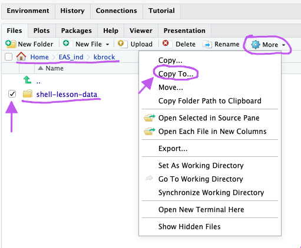
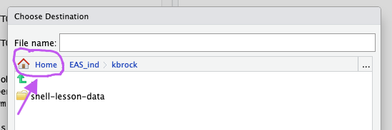
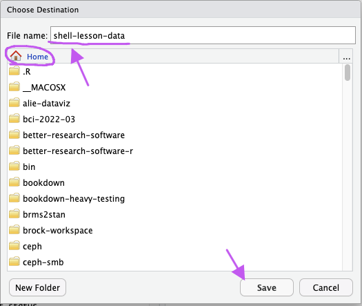
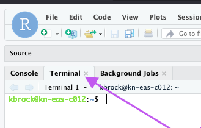
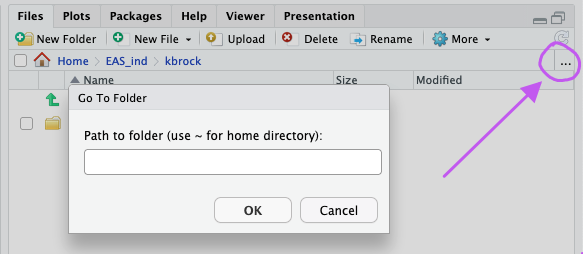

# Working with Files in the Command Line

<!-- TOC start (generated with https://github.com/derlin/bitdowntoc) -->

- [Working with Files in the Command Line](#working-with-files-in-the-command-line)
  - [About](#about)
    - [Attribution/License](#attributionlicense)
    - [Objectives and Questions](#objectives-and-questions)
  - [Setup](#setup)
    - [Log on to RStudio Server](#log-on-to-rstudio-server)
    - [Set Up Interface](#set-up-interface)
    - [Copy files](#copy-files)
    - [Where to type commands: How to open a new shell](#where-to-type-commands-how-to-open-a-new-shell)
  - [Introducing the Shell](#introducing-the-shell)
    - [What is a Command Line Interface?](#what-is-a-command-line-interface)
    - [Why use the shell?](#why-use-the-shell)
    - [Let's get started](#lets-get-started)
    - [Nelle's Pipeline: A Typical Problem](#nelles-pipeline-a-typical-problem)
    - [Summary](#summary)
  - [Navigating Files and Directories](#navigating-files-and-directories)
    - [Home directories on other systems](#home-directories-on-other-systems)
    - [Clearing your terminal](#clearing-your-terminal)
      - [Getting help](#getting-help)
        - [The `--help` option](#the---help-option)
        - [The `man` command](#the-man-command)
      - [Exploring Other Directories](#exploring-other-directories)
    - [General Syntax of a Shell Command](#general-syntax-of-a-shell-command)
      - [Nelle's Pipeline: Organizing Files](#nelles-pipeline-organizing-files)
    - [Summary](#summary-1)
  - [Working With Files and Directories](#working-with-files-and-directories)
    - [Creating directories](#creating-directories)
    - [Moving files and directories](#moving-files-and-directories)
    - [Copying files and directories](#copying-files-and-directories)
    - [Removing files and directories](#removing-files-and-directories)
    - [Operations with multiple files and directories](#operations-with-multiple-files-and-directories)
      - [Using wildcards for accessing multiple files at once](#using-wildcards-for-accessing-multiple-files-at-once)
    - [Summary](#summary-2)
  - [Finding Things](#finding-things)
    - [Next time](#next-time)
    - [Summary](#summary-3)

<!-- TOC end -->

## About

### Attribution/License

This content is a remix of The Carpentries Lesson [The Unix Shell](https://swcarpentry.github.io/shell-novice/) episodes 1, 2, 3 and 7 released and used under [CC-BY](https://swcarpentry.github.io/shell-novice/LICENSE.html). This lesson was remixed by Katrina Brock and the remix is not endorsed by The Carpentries. Summary of changes can be found [here](./remix-summary.md)

### Objectives and Questions

In this workshop, you will practice using basic tools to build familliarity with command line.
It's possible that you already know how to do similar things in another programming language,
but building familliarity with shell will open up other programs and tools that primarily
work through the command line (such as git).

<details> <summary> Learning Objectives </summary>

- Introducing the shell
- Explain how the shell relates to the keyboard, the screen, the operating system, and users' programs.
- Explain when and why command-line interfaces should be used instead of graphical interfaces.
- Navigating Files and Directories
- Explain the similarities and differences between a file and a directory.
- Translate an absolute path into a relative path and vice versa.
- Construct absolute and relative paths that identify specific files and directories.
- Use options and arguments to change the behaviour of a shell command.
- Demonstrate the use of tab completion and explain its advantages.
- Working with Files and Directories
- Delete, copy and move specified files and/or directories.
- Create files in that hierarchy using an editor or by copying and renaming existing files.
- Create a directory hierarchy that matches a given diagram.
- Finding Things
- Use `grep` to select lines from text files that match simple patterns.
- Use `find` to find files and directories whose names match simple patterns.
- Use the output of one command as the command-line argument(s) to another command.
- Explain what is meant by 'text' and 'binary' files, and why many common tools don't handle the latter well.

</details>

<details> <summary> Questions </summary>

- What is a command shell and why would I use one?
- How can I move around on my computer?
- How can I see what files and directories I have?
- How can I specify the location of a file or directory on my computer?
- How can I create, copy, and delete files and directories?
- How can I edit files?
- How can I find files?
- How can I find things in files?

</details>

## Setup

### Log on to RStudio Server

If you have an MPI AB account from IT (used to access EAS and CB data servers and MPI AB VPN), you can access the EAS R Studio server using that account. If not, I (Brock) will create an account for you on the fly.

You need be either on MPI AB VPN or using a wired connection at an MPI AB office location to access this webpage.

Log in here: https://kn-eas-rstudio.top.ab.mpg.de/

### Set Up Interface

We are *not* using R, just using the RStudio interface to access terminal and a GUI file explorer through the web.

Close out an R project you might have open.  If it says "Project: None" in the top right, you're all set. If not, click the dropdown next to your project name and select "Close Project".

Maximize the "Terminal" and "Files" tabs.


### Copy files

The materials for this lesson can be found in my individual folder. You can copy them using the R Studio file explorer like this:

- In the file explorer, navigate to `EAS_ind/kbrock`.
- Check the checkbox next to `shell-lesson-data`.
- In the "More..." dropdown, select "Copy to...."
- A dialog box should pop up. Click "Home".
- Type `shell-lesson-data` in the "Filename:" prompt.
- Click "Save"







### Where to type commands: How to open a new shell

In this workshop, we'll be typing into the "Terminal" tab which is for shell commands. This is different from the "Console" tab which is for R code.



<details> <summary>More..</summary>

The R Studio server runs Ubuntu Linux and the unix shell is bash. This works very similarly to the default "Terminal" on MacOS. It is very different from the default shell for windows. If you eventually want to apply what you learn today to a machine, you can use an emulator such as [Git for Windows][install_shell] or [Install the Windows Subsystem for Linux][wsl] after the workshop.

</details>

## Introducing the Shell

### What is a Command Line Interface?

Humans and computers commonly interact in many different ways, such as through a keyboard and mouse,
touch screen interfaces, or using speech recognition systems.
The most widely used way to interact with personal computers is called a
**graphical user interface** (GUI).
With a GUI, we give instructions by clicking a mouse and using menu-driven interactions.

While the visual aid of a GUI makes it intuitive to learn,
this way of interacting scales very poorly for some tasks.

A **command-line interface** (CLI) allows users to to interact with computer by reading and writing text. It excels at making repetitive tasks automatic and fast.

A **shell** is a particular program that lets you type commands.
In this workshop, we will be using "Bash" which is the most popular Unix shell.
Bash is often the default shell on Unix and in Unix-like tools for Windows.

### Why use the shell?

Imagine the following task:
for a literature search, you have to copy the third line of one thousand text files in one thousand
different directories and paste it into a single file.

Using a GUI, you would not only be clicking at your desk for several hours,
but you could potentially also commit an error in the process of completing this repetitive task.

Using a CLI, you can write a series of commands that does this consistently and nearly instantly.

The shell can be used for simple tasks like creating an empty folder
and for launching (even complex) programs with a single command.
In fact, some specialized tools and resources
such as high-performance computing systems
virtually require users to be familliar with the shell.
Shell commands can be combined together and saved into reddproducible *scripts*
that handle large volumes of data automatically.

Using the shell will take some effort and some time to learn.
While a GUI presents you with choices to select, CLI choices are not automatically presented to you. It can be daunting at first, but once you've come familliar with this different style
of iteracting, you will be able to find and use the information you need to accomplish
a huge variety of tasks.

### Let's get started

When the shell is first opened, you are presented with a **prompt**,
indicating that the shell is waiting for input.

```bash
kbrock@kn-eas-c012:~$
```

Parts of the prompt:

- your username (`kbrock` above)
- `@` seperator between username and hostname
- `kn-eas-c012` this is the hosname of the RStudio server
- `:` separator between hostname and folder
- `~` the current working directory. The symbol `~` represents your home directory.
(Note this is your home directory on the RStudio server, not your home directory on your
laptop or your home directory on the data server.)
- `$` symbol indicating the end of the prompt and where you start typing.

The prompt is followed by a **text cursor**, a character that indicates the position where your
typing will appear. The cursor looks like a flashing block or virtical line. (Ususally a virtical line in other programs.)

In the examples for this workshop, the entire prompt is represented by `$ `.
Most importantly, *do not type the prompt* when typing commands.
Only type the command that follows the prompt.

This rule applies both in these lessons and in lessons from other sources.
Also note that after you type a command, you have to press the <kbd>Enter</kbd> key to execute it.

So let's try our first command, `ls`, which is short for listing.
This command will list the contents of the current directory:

```bash
$ ls
```

```output
eas-coding-workshops  EAS_ind  EAS_share  R  shell-lesson-data
```

> [!NOTE]
>
>### Command not found
>
>If the shell can't find a program whose name is the command you typed, it
>will print an error message such as:
>
>```bash
>$ ks
>```
>
>```output
>ks: command not found
>```
>
>This might happen if the command was mis-typed or if the program corresponding to that command
>is not installed.
>


### Nelle's Pipeline: A Typical Problem

Nelle Nemo, a marine biologist,
has just returned from a six-month survey of the
[North Pacific Gyre](https://en.wikipedia.org/wiki/North_Pacific_Gyre),
where she has been sampling gelatinous marine life in the
[Great Pacific Garbage Patch](https://en.wikipedia.org/wiki/Great_Pacific_Garbage_Patch).
She has 1520 samples that she's run through an assay machine to measure the relative abundance
of 300 proteins.
She needs to run these 1520 files through an imaginary program called `goostats.sh`.
In addition to this huge task, she has to write up results by the end of the month, so her paper
can appear in a special issue of *Aquatic Goo Letters*.

If Nelle chooses to run `goostats.sh` by hand using a GUI,
she'll have to select and open a file 1520 times.
If `goostats.sh` takes 30 seconds to run each file, the whole process will take more than 12 hours
of Nelle's attention.
With the shell, Nelle can instead assign her computer this mundane task while she focuses
her attention on writing her paper.

The next few lessons will explore the ways Nelle can achieve this.
More specifically,
the lessons explain how she can use a command shell to run the `goostats.sh` program,
using loops to automate the repetitive steps of entering file names,
so that her computer can work while she writes her paper.

As a bonus,
once she has put a processing pipeline together,
she will be able to use it again whenever she collects more data.

In order to achieve her task, Nelle needs to know how to:

Covered in this session:

- navigate to a file/directory
- create a file/directory
- check the length of a file

Covered in the next session:

- chain commands together
- retrieve a set of files
- iterate over files
- run a shell script containing her pipeline

### Summary

- A shell is a program whose primary purpose is to read commands and run other programs.
- This lesson uses Bash, the default shell in many implementations of Unix.
- Programs can be run in Bash by entering commands at the command-line prompt.
- The shell's main advantages are its high action-to-keystroke ratio, its support for automating repetitive tasks, and its capacity to access networked machines.
- A significant challenge when using the shell can be knowing what commands need to be run and how to run them.


## Navigating Files and Directories


Introducing and navigating the filesystem in the shell
(covered in [Navigating Files and Directories](02-filedir.md) section)
can be confusing. You may have both terminal and GUI file explorer
open side by side so learners can see the content and file
structure while they're using terminal to navigate the system.


The part of the operating system responsible for managing files and directories
is called the **file system**.
It organizes our data into files,
which hold information,
and directories (also called 'folders'),
which hold files or other directories.

Several commands are frequently used to create, inspect, rename, and delete files and directories.
To start exploring them, we'll go to our open shell window.

First, let's find out where we are by running a command called `pwd`
(which stands for 'print working directory'). Directories are like *places* — at any time
while we are using the shell, we are in exactly one place called
our **current working directory**. Commands mostly read and write files in the
current working directory, i.e. 'here', so knowing where you are before running
a command is important. `pwd` shows you where you are:

```bash
$ pwd
```

```output
/home/TOP/kbrock
```

Here,
the computer's response is `/home/TOP/kbrock`
which my **home directory**.

If you see something vastly different, you may need to navigate to
your home directory using `cd`.

```bash
$ cd ~
```

To understand what a 'home directory' is,
let's have a look at how the file system as a whole is organized.

Below is a diagram of part of the filesystem of the EAS RStudio Server.
I've skipped many files for simplicity and replaced usernames (besides my own)
with fake ones to respect privacy:

```
/
├── bin
├── boot
├── cdrom
├── dev
├── etc
├── home
|   ├── TOP
│   │   ├── asmith
│   │   ├── bjones
│   │   |   ...
│   │   ├── imhotep
│   │   ├── kbrock
│   │   ├── larry
│   │   |   ...
│   │   └── zhenry
├── media
├── mnt
|   ├── EAS_ind
│   │   ├── admin_hra
│   │   ├── admin_ig
│   │   ├── asmith
│   │   ├── bjones
│   │   |   ...
│   │   ├── imhotep
│   │   ├── kbrock
│   │   ├── larry
│   │   |   ...
│   │   └── zhenry
|   └── EAS_shared
│       ├── baboon
│       ├── bat_foraging
│       ├── bci_general
│       ├── blackbuck
│       ├── bonobo
│       |   ...
│       └── wilddog
├── opt
├── proc
├── root
|   ...
├── tmp
├── usr
└── var
```

The filesystem looks like an upside down tree.
The topmost directory  is the **root directory**
that holds everything else.

We refer to it using a slash character, `/`, on its own;
this character is the leading slash in `/home/TOP/kbrock/`.

Inside that directory are several other directories:
`bin` (which is where some built-in programs are stored),
`home` (where users' personal directories are located),
`mnt` (where mounts from other filesystems are located)
`tmp` (for temporary files that don't need to be stored long-term),
and so on.

We know that our current working directory `/home/TOP/your-username` is stored inside `/home/TOP`
because `/home/TOP` is the first part of its name.
Similarly,
we know that `TOP` is stored in `home` which is stored inside the root directory aka `/`.

> [!NOTE]
>
>### Slashes
>
>Notice that there are two meanings for the `/` character.
>When it appears at the front of a file or directory name,
>it refers to the root directory. When it appears *inside* a path,
>it's just a separator.
>
>


Underneath `/home/TOP/`,
we find one directory for each user, for example
the fake scientists *imhotep* and *larry*.

{alt='Like other directories, home directories are sub-directories underneath "/Users" like "/Users/imhotep", "/Users/larry" or"/Users/nelle"'}

The user *imhotep*'s files are stored in `/home/TOP/imhotep`,
user *larry*'s in `/home/TOP/larry`, and mine in `/home/TOP/kbrock`.
Therefore, I get `/home/TOP/nelle` as our home directory.
Typically, when you open a new command prompt, you will be in
your home directory to start.

<details> <summary>More..</summary>

### Home directories on other systems

Most, if not all operating systems have a special folder where
all the home directories are stored. EAS RStudio server has
that directory specially configured to be `/home/TOP`. The default
on linux is `/home`. The default on Mac is `/Users` and
and on Windows, `C:\Documents and Settings\` or `C:\Users\`.

</details>

Now let's learn the command that will let us see the contents of our
own filesystem.  We can see what's in our home directory by running `ls`:

```bash
$ ls
```

```output
eas-coding-workshops  EAS_ind  EAS_share  R  shell-lesson-data
```

Your results will be slightly different depending on what folders you've added.


`ls` prints the names of the files and directories in the current directory.
We can make its output more comprehensible by using the `-F` **option**
which tells `ls` to classify the output
by adding a marker to file and directory names to indicate what they are:

- a trailing `/` indicates that this is a directory
- `@` indicates a link
- `*` indicates an executable

Depending on your shell's default settings,
the shell might also use colors to indicate whether each entry is a file or
directory.

```bash
$ ls -F
```

```output
eas-coding-workshops/  EAS_ind@  EAS_share@  R/  shell-lesson-data/
```

Here,
we can see that the home directory contains **sub-directories** and **links**.
Any names in the output that don't have a classification symbol
are **files** in the current working directory.

<details> <summary>More..</summary>

### Clearing your terminal

If your screen gets too cluttered, you can clear your terminal using the
`clear -x` command. You can still access previous commands using <kbd>↑</kbd>
and <kbd>↓</kbd> to move line-by-line, or by scrolling in your terminal.

For some Bash configurations, `clear` may also clear the scrollbuffer and you
will not be able to scroll back after using `clear`; using `clear -x` prevents
this. An alternative to `clear -x` is the keyboard shortcut `Control-L`.


</details>

#### Getting help

`ls` has lots of other **options**. There are two common ways to find out how
to use a command and what options it accepts ---
**depending on your environment and the command, you might find that only one of these ways works:**

1. We can pass a `--help` option to any command (available on Linux and Git Bash), for example:

```bash
$ ls --help
```

2. We can read its manual with `man` (available on Linux and macOS):

```bash
$ man ls
```

We'll describe both ways next.

> [!NOTE]
>
>### Help for built-in commands
>
>Some commands are built in to the Bash shell, rather than existing as separate
>programs on the filesystem. One example is the `cd` (change directory) command.
>If you get a message like `No manual entry for cd`, try `help cd` instead. The
>`help` command is how you get usage information for
>[Bash built-ins](https://www.gnu.org/software/bash/manual/html_node/Bash-Builtins.html).
>
>


##### The `--help` option

Most bash commands and programs that people have written to be
run from within bash, support a `--help` option that displays more
information on how to use the command or program.

```bash
$ ls --help
```

```output
Usage: ls [OPTION]... [FILE]...
List information about the FILEs (the current directory by default).
Sort entries alphabetically if neither -cftuvSUX nor --sort is specified.

Mandatory arguments to long options are mandatory for short options, too.
-a, --all                  do not ignore entries starting with .
-A, --almost-all           do not list implied . and ..
--author               with -l, print the author of each file
-b, --escape               print C-style escapes for nongraphic characters
--block-size=SIZE      scale sizes by SIZE before printing them; e.g.,
'--block-size=M' prints sizes in units of
1,048,576 bytes; see SIZE format below
-B, --ignore-backups       do not list implied entries ending with ~
-c                         with -lt: sort by, and show, ctime (time of last
modification of file status information);
with -l: show ctime and sort by name;
otherwise: sort by ctime, newest first
-C                         list entries by columns
--color[=WHEN]         colorize the output; WHEN can be 'always' (default
if omitted), 'auto', or 'never'; more info below
-d, --directory            list directories themselves, not their contents
-D, --dired                generate output designed for Emacs' dired mode
-f                         do not sort, enable -aU, disable -ls --color
-F, --classify             append indicator (one of */=>@|) to entries
...        ...        ...
```

> [!NOTE]
>
>#### When to use short or long options
>When options exist as both short and long options:
>
>- Use the short option when typing commands directly into the
>shell to minimize keystrokes and get your task done faster.
>- Use the long option in scripts to provide clarity.
>It will be read many times and typed once.
>


> [!NOTE]
>
>### Unsupported command-line options
>
>If you try to use an option that is not supported, `ls` and other commands
>will usually print an error message similar to:
>
>```bash
>$ ls -j
>```
>
>```error
>ls: invalid option -- 'j'
>Try 'ls --help' for more information.
>```
>


<details> <summary>More..</summary>
##### The `man` command

The other way to learn about `ls` is to type

```bash
$ man ls
```

This command will turn your terminal into a page with a description
of the `ls` command and its options.

To navigate through the `man` pages,
you may use <kbd>↑</kbd> and <kbd>↓</kbd> to move line-by-line,
or try <kbd>b</kbd> and <kbd>Spacebar</kbd> to skip up and down by a full page.
To search for a character or word in the `man` pages,
use <kbd>/</kbd> followed by the character or word you are searching for.
Sometimes a search will result in multiple hits.
If so, you can move between hits using <kbd>N</kbd> (for moving forward) and
<kbd>Shift</kbd>\+<kbd>N</kbd> (for moving backward).

To **quit** the `man` pages, press <kbd>q</kbd>.

</details>

> [!NOTE]
>
>### Manual pages on the web
>
>Of course, there is a third way to access help for commands:
>searching the internet via your web browser.
>When using internet search, including the phrase `unix man page` in your search
>query will help to find relevant results.
>
>GNU provides links to its
>[manuals](https://www.gnu.org/manual/manual.html) including the
>[core GNU utilities](https://www.gnu.org/software/coreutils/manual/coreutils.html),
>which covers many commands introduced within this lesson.
>
>


### :muscle: Challenge

### Exploring More `ls` Options

You can also use two options at the same time. What does the command `ls` do when used
with the `-l` option? What about if you use both the `-l` and the `-h` option?

Some of its output is about properties that we do not cover in this lesson (such
as file permissions and ownership), but the rest should be useful
nevertheless.

<details> <summary>View Solution...</summary>

### Solution

The `-l` option makes `ls` use a **l**ong listing format, showing not only
the file/directory names but also additional information, such as the file size
and the time of its last modification. If you use both the `-h` option and the `-l` option,
this makes the file size '**h**uman readable', i.e. displaying something like `5.3K`
instead of `5369`.

</details>


### :muscle: Challenge

### Listing in Reverse Chronological Order

By default, `ls` lists the contents of a directory in alphabetical
order by name. The command `ls -t` lists items by time of last
change instead of alphabetically. The command `ls -r` lists the
contents of a directory in reverse order.
Which file is displayed last when you combine the `-t` and `-r` options?
Hint: You may need to use the `-l` option to see the
last changed dates.

<details> <summary>View Solution...</summary>

### Solution

The most recently changed file is listed last when using `-rt`. This
can be very useful for finding your most recent edits or checking to
see if a new output file was written.

</details>


#### Exploring Other Directories

Not only can we use `ls` on the current working directory,
but we can use it to list the contents of a different directory.

Let's take a look at the `shell-lesson-data` directory that we moved over
for this lesson. We know that directory is our home directory because we
saw it in the `ls` ouptut above.

We can list the contents of the lesson directory with `ls -F shell-lesson-data`,
i.e.,
the command `ls` with the `-F` **option** and the [**argument**][Arguments]  `Desktop`.

```bash
$ ls -F shell-lesson-data
```

```output
exercise-data/  north-pacific-gyre/
```

Organizing things hierarchically helps us keep track of our work. While it's
possible to put hundreds of files in our home directory just as it's possible to
pile hundreds of printed papers on our desk, it's much easier to find things when
they've been organized into sensibly-named subdirectories.

Now, we can actually change our location to a different directory, so
we are no longer located in
our home directory.

The command to change locations is `cd` followed by a
directory name to change our working directory.
`cd` stands for 'change directory',
which is a bit misleading.
The command doesn't change the directory;
it changes the shell's current working directory.
In other words it changes the shell's settings for what directory we are in.
The `cd` command is akin to double-clicking a folder in a graphical interface
to get into that folder.

Let's say we want to move into the `exercise-data` directory we saw above. We can
use the following series of commands to get there:

```bash
$ cd shell-lesson-data
$ cd exercise-data
```

These commands will move us from our home directory into our Desktop directory, then into
the `shell-lesson-data` directory, then into the `exercise-data` directory.
You will notice that `cd` doesn't print anything. This is normal.
Many shell commands will not output anything to the screen when successfully executed.
But if we run `pwd` after it, we can see that we are now
in `/Users/nelle/Desktop/shell-lesson-data/exercise-data`.

If we run `ls -F` without arguments now,
it lists the contents of `/home/TOP/<your username>/shell-lesson-data/exercise-data`,
because that's where we now are:

```bash
$ pwd
```

```output
/home/TOP/kbrock/shell-lesson-data/exercise-data
```

```bash
$ ls -F
```

```output
alkanes/  animal-counts/  creatures/  numbers.txt  writing/
```

We now know how to go down the directory tree (i.e. how to go into a subdirectory),
but how do we go up (i.e. how do we leave a directory and go into its parent directory)?
We might try the following:

```bash
$ cd shell-lesson-data
```

```error
-bash: cd: shell-lesson-data: No such file or directory
```

But we get an error! Why is this?

With our methods so far,
`cd` can only see sub-directories inside your current directory. There are
different ways to see directories above your current location; we'll start
with the simplest.

There is a shortcut in the shell to move up one directory level. It works as follows:

```bash
$ cd ..
```

`..` is a special directory name meaning
"the directory containing this one",
or more succinctly,
the **parent** of the current directory.
Sure enough,
if we run `pwd` after running `cd ..`, we're back in `shell-lesson-data`:

```bash
$ pwd
```

```output
/home/TOP/kbrock/shell-lesson-data/exercise-data
```

The special directory `..` doesn't usually show up when we run `ls`. If we want
to display it, we can add the `-a` option to `ls -F`:

```bash
$ ls -F -a
```

```output
./  ../  exercise-data/  north-pacific-gyre/
```

`-a` stands for 'show all' (including hidden files);
it forces `ls` to show us file and directory names that begin with `.`,
such as `..` (which, if we're in our home directory on the RStudio server, refers to the `/home/TOP` directory).
As you can see,
it also displays another special directory that's just called `.`,
which means 'the current working directory'.
It may seem redundant to have a name for it,
but we'll see some uses for it soon.

Note that in most command line tools, multiple options can be combined
with a single `-` and no spaces between the options; `ls -F -a` is
equivalent to `ls -Fa`.

> [!NOTE]
>
>### Other Hidden Files
>
>In addition to the hidden directories `..` and `.`, you may also see a file
>called `.bash_profile`. This file usually contains shell configuration
>settings. You may also see other files and directories beginning
>with `.`. These are usually files and directories that are used to configure
>different programs on your computer. The prefix `.` is used to prevent these
>configuration files from cluttering the terminal when a standard `ls` command
>is used.
>
>


These three commands are the basic commands for navigating the filesystem on your computer:
`pwd`, `ls`, and `cd`. Let's explore some variations on those commands. What happens
if you type `cd` on its own, without giving
a directory?

```bash
$ cd
```

How can you check what happened? `pwd` gives us the answer!

```bash
$ pwd
```

```output
/Users/nelle
```

It turns out that `cd` without an argument will return you to your home directory,
which is great if you've got lost in your own filesystem.

Let's try returning to the `exercise-data` directory from before. Last time, we used
three commands, but we can actually string together the list of directories
to move to `exercise-data` in one step:

```bash
$ cd shell-lesson-data/exercise-data
```

Check that we've moved to the right place by running `pwd` and `ls -F`.

If we want to move up one level from the data directory, we could use `cd ..`.  But
there is another way to move to any directory, regardless of your
current location.

So far, when specifying directory names, or even a directory path (as above),
we have been using **relative paths**.  When you use a relative path with a command
like `ls` or `cd`, it tries to find that location from where we are,
rather than from the root of the file system.

However, it is possible to specify the **absolute path** to a directory by
including its entire path from the root directory, which is indicated by a
leading slash. The leading `/` tells the computer to follow the path from
the root of the file system, so it always refers to exactly one directory,
no matter where we are when we run the command.

This allows us to move to our `shell-lesson-data` directory from anywhere on
the filesystem (including from inside `exercise-data`). To find the absolute path
we're looking for, we can use `pwd` and then extract the piece we need
to move to `shell-lesson-data`.

```bash
$ pwd
```

```output
/Users/nelle/Desktop/shell-lesson-data/exercise-data
```

```bash
$ cd /Users/nelle/Desktop/shell-lesson-data
```

Run `pwd` and `ls -F` to ensure that we're in the directory we expect.

> [!NOTE]
>
>### Two More Shortcuts
>
>The shell interprets a tilde (`~`) character at the start of a path to
>mean "the current user's home directory". For example, since my home directory is
>`/home/TOP/kbrock`, then `~/data` is equivalent to
>`/home/TOP/kbrock`. This only works if it is the first character in the
>path; `here/there/~/elsewhere` is *not* `here/there//home/TOP/kbrock`.
>
>Another shortcut is the `-` (dash) character. `cd` will translate `-` into
>*the previous directory I was in*, which is faster than having to remember,
>then type, the full path.  This is a *very* efficient way of moving
>*back and forth between two directories* -- i.e. if you execute `cd -` twice,
>you end up back in the starting directory.
>
>The difference between `cd ..` and `cd -` is
>that the former brings you *up*, while the latter brings you *back*.
>
>***
>
>Try it!
>First navigate to `~/Desktop/shell-lesson-data` (you should already be there).
>
>```bash
>$ cd ~/shell-lesson-data
>```
>
>Then `cd` into the `exercise-data/creatures` directory
>
>```bash
>$ cd exercise-data/creatures
>```
>
>Now if you run
>
>```bash
>$ cd -
>```
>
>you'll see you're back in `~/Desktop/shell-lesson-data`.
>Run `cd -` again and you're back in `~/Desktop/shell-lesson-data/exercise-data/creatures`
>
>


### :muscle: Challenge

### Absolute vs Relative Paths

Starting from `/home/TOP/yourusername/data`,
which of the following commands could you use to navigate to her home directory,
which is `/home/TOP/yourusername/`? (More than one can be correct.)

1. `cd .`
2. `cd /`
3. `cd /Users/yourusername`
4. `cd ../..`
5. `cd ~`
6. `cd home`
7. `cd ~/data/..`
8. `cd`
9. `cd ..`

<details> <summary>View Solution...</summary>

### Solution

1. No: `.` stands for the current directory.
2. No: `/` stands for the root directory.
3. No: Your home directory would be `/home/TOP/yourusername/`.
4. No: this command goes up two levels, i.e. ends in `/Users`.
5. Yes: `~` stands for the user's home directory, in this case `/Users/nelle`.
6. No: this command would navigate into a directory `home` in the current directory
if it exists.
7. Yes: unnecessarily complicated, but correct.
8. Yes: shortcut to go back to the user's home directory.
9. Yes: goes up one level.

</details>


### :muscle: Challenge

### Relative Path Resolution

Using the filesystem diagram below, if `pwd` displays `/Users/thing`,
what will `ls -F ../backup` display?

1. `../backup: No such file or directory`
2. `2012-12-01 2013-01-08 2013-01-27`
3. `2012-12-01/ 2013-01-08/ 2013-01-27/`
4. `original/ pnas_final/ pnas_sub/`

```
/
└── Users
├── thing
│   └── backup
│   |   ├── 2012-12-01
│   |   ├── 2013-01-08
│   |   └── 2013-01-27
|   └── final
|
└── backup
├── original
├── pnas_final
└── pnas_sub
```

<details> <summary>View Solution...</summary>

### Solution

1. No: there *is* a directory `backup` in `/Users`.
2. No: this is the content of `Users/thing/backup`,
but with `..`, we asked for one level further up.
3. No: see previous explanation.
4. Yes: `../backup/` refers to `/Users/backup/`.


</details>


### :muscle: Challenge

### `ls` Reading Comprehension

Using the filesystem diagram below,
if `pwd` displays `/Users/backup`,
and `-r` tells `ls` to display things in reverse order,
what command(s) will result in the following output:

```output
pnas_sub/ pnas_final/ original/
```
1. `ls pwd`
2. `ls -r -F`
3. `ls -r -F /Users/backup`

```
/
└── Users
├── thing
│   └── backup
│   |   ├── 2012-12-01
│   |   ├── 2013-01-08
│   |   └── 2013-01-27
|   └── final
|
└── backup
├── original
├── pnas_final
└── pnas_sub
```

<details> <summary>View Solution...</summary>

### Solution

1. No: `pwd` is not the name of a directory.
2. Yes: `ls` without directory argument lists files and directories
in the current directory.
3. Yes: uses the absolute path explicitly.


</details>


### General Syntax of a Shell Command

We have now encountered commands, options, and arguments,
but it is perhaps useful to formalise some terminology.

Consider the command below as a general example of a command,
which we will dissect into its component parts:

```bash
$ ls -F /
```

{alt='General syntax of a shell command'}

`ls` is the **command**, with an **option** `-F` and an
**argument** `/`.
We've already encountered options  which
either start with a single dash (`-`), known as **short options**,
or two dashes (`--`), known as **long options**.
[Options] change the behavior of a command and
[Arguments] tell the command what to operate on (e.g. files and directories).
Sometimes options and arguments are referred to as **parameters**.
A command can be called with more than one option and more than one argument, but a
command doesn't always require an argument or an option.

You might sometimes see options being referred to as **switches** or **flags**,
especially for options that take no argument. In this lesson we will stick with
using the term *option*.

Each part is separated by spaces. If you omit the space
between `ls` and `-F` the shell will look for a command called `ls-F`, which
doesn't exist. Also, capitalization can be important.
For example, `ls -s` will display the size of files and directories alongside the names,
while `ls -S` will sort the files and directories by size, as shown below:

```bash
$ cd ~/shell-lesson-data
$ ls -s exercise-data
```

```output
total 28
4 animal-counts   4 creatures  12 numbers.txt   4 alkanes   4 writing
```

Note that the sizes returned by `ls -s` are in *blocks*.
As these are defined differently for different operating systems,
you may not obtain the same figures as in the example.

```bash
$ ls -S exercise-data
```

```output
animal-counts  creatures  alkanes  writing  numbers.txt
```

Putting all that together, our command `ls -F /` above gives us a listing
of files and directories in the root directory `/`.
An example of the output you might get from the above command is given below:

```bash
$ ls -F /
```

```output
Applications/         System/
Library/              Users/
Network/              Volumes/
```

#### Nelle's Pipeline: Organizing Files

Knowing this much about files and directories,
let's go back to Nelle's pipeline problem, and
try organizing the files that this protein assay machine will create.

Before giving us this directory, Nelle
created a directory called `north-pacific-gyre`
(to remind herself where the data came from),
which will contain the data files from the assay machine
and her data processing scripts.

Each of her physical samples is labelled according to her lab's convention
with a unique ten-character ID,
such as 'NENE01729A'.
This ID is what she used in her collection log
to record the location, time, depth, and other characteristics of the sample,
so she decides to use it within the filename of each data file.
Since the output of the assay machine is plain text,
she will call her files `NENE01729A.txt`, `NENE01812A.txt`, and so on.
All 1520 files will go into the same directory.

Now in the directory `shell-lesson-data`,
we can see what files she has using the command:

```bash
$ ls north-pacific-gyre/
```

This command is a lot to type,
but she can let the shell do most of the work through what is called **tab completion**.
If she types:

```bash
$ ls nor
```

and then presses <kbd>Tab</kbd> (the tab key on her keyboard),
the shell automatically completes the directory name for her:

```bash
$ ls north-pacific-gyre/
```

Pressing <kbd>Tab</kbd> again does nothing,
since there are multiple possibilities;
pressing <kbd>Tab</kbd> twice brings up a list of all the files.

If we then presses <kbd>G</kbd> and then presses <kbd>Tab</kbd> again,
the shell will append 'goo' since all files that start with 'g' share
the first three characters 'goo'.

```bash
$ ls north-pacific-gyre/goo
```

To see all of those files, she can press <kbd>Tab</kbd> twice more.

```bash
ls north-pacific-gyre/goo
goodiff.sh   goostats.sh
```

This is called **tab completion**,
and we will see it in many other tools as we go on.


[Arguments]: https://swcarpentry.github.io/shell-novice/reference.html#argument
[Options]: https://swcarpentry.github.io/shell-novice/reference.html#option

### Summary

- The file system is responsible for managing information on the disk.
- Information is stored in files, which are stored in directories (folders).
- Directories can also store other directories, which then form a directory tree.
- `pwd` prints the user's current working directory.
- `ls [path]` prints a listing of a specific file or directory; `ls` on its own lists the current working directory.
- `cd [path]` changes the current working directory.
- Most commands take options that begin with a single `-`.
- Directory names in a path are separated with `/` on Unix, but `\` on Windows.
- `/` on its own is the root directory of the whole file system.
- An absolute path specifies a location from the root of the file system.
- A relative path specifies a location starting from the current location.
- `.` on its own means 'the current directory'; `..` means 'the directory above the current one'.


## Working With Files and Directories


### Creating directories

We now know how to explore files and directories,
but how do we create them in the first place?

In this episode we will learn about creating and moving files and directories,
using the `exercise-data/writing` directory as an example.

#### Step one: see where we are and what we already have

We should still be in the `shell-lesson-data` directory on the Desktop,
which we can check using:

```bash
$ pwd
```

```output
/home/TOP/kbrock/shell-lesson-data
```

Next we'll move to the `exercise-data/writing` directory and see what it contains:

```bash
$ cd exercise-data/writing/
$ ls -F
```

```output
haiku.txt  LittleWomen.txt
```

#### Create a directory

Let's create a new directory called `thesis` using the command `mkdir thesis`
(which has no output):

```bash
$ mkdir thesis
```

As you might guess from its name,
`mkdir` means 'make directory'.
Since `thesis` is a relative path
(i.e., does not have a leading slash, like `/what/ever/thesis`),
the new directory is created in the current working directory:

```bash
$ ls -F
```

```output
haiku.txt  LittleWomen.txt  thesis/
```

Since we've just created the `thesis` directory, there's nothing in it yet:

```bash
$ ls -F thesis
```

Note that `mkdir` is not limited to creating single directories one at a time.
The `-p` option allows `mkdir` to create a directory with nested subdirectories
in a single operation:

```bash
$ mkdir -p ../project/data ../project/results
```

The `-R` option to the `ls` command will list all nested subdirectories within a directory.
`R` in `-R` stands for "Recursive" which refers to the idea that the output of a process
becomes the input of another iteration of that same process.
So in this case, `ls -R` lists the contents of a directory, and for every directory
inside it lists the contents of that directory, and for every directory inside those subdirectories, it lists the contents, and so on.

Let's use `ls -FR` to recursively list the new directory hierarchy we just created in the
`project` directory:

```bash
$ ls -FR ../project
```

```output
../project/:
data/  results/

../project/data:

../project/results:
```

> [!NOTE]
>
>### Two ways of doing the same thing
>
>Using the shell to create a directory is no different than using a file explorer.
>If you open the current directory using your operating system's graphical file explorer,
>the `thesis` directory will appear there too.
>While the shell and the file explorer are two different ways of interacting with the files,
>the files and directories themselves are the same.
>


> [!NOTE]
>
>### Jump to a file path in RStudio file explorer
>
>If you want to go to a particular path in RStudio file explorer
>without clicking in and out of folders, you can do this by
>clicking the `...` in the top left of the file explorer pane.
>Then, type or paste the path you want to go to.
>
>
>
>When using a relative path, it should be relative to the
>directory that the file explorer is currently in,
>which might or might not be the same as your working directory.
>


> [!NOTE]
>
>### Good names for files and directories
>
>Complicated names of files and directories can make your life painful
>when working on the command line. Here we provide a few useful
>tips for the names of your files and directories.
>
>1. Don't use spaces.
>
>Spaces can make a name more meaningful,
>but since spaces are used to separate arguments on the command line
>it is better to avoid them in names of files and directories.
>You can use `-` or `_` instead (e.g. `north-pacific-gyre/` rather than `north pacific gyre/`).
>To test this out, try typing `mkdir north pacific gyre` and see what directory (or directories!)
>are made when you check with `ls -F`.
>
>2. Don't begin the name with `-` (dash).
>
>Commands treat names starting with `-` as options.
>
>3. Stick with lowercase letters, numbers, `.` (period or 'full stop'), `-` (dash) and `_` (underscore).
>
>Many other characters have special meanings on the command line.
>We will learn about some of these during this lesson.
>There are special characters that can cause your command to not work as
>expected and can even result in data loss.
>
>If you need to refer to names of files or directories that have spaces
>or other special characters, you should surround the name in single
>[quotes](https://www.gnu.org/software/bash/manual/html_node/Quoting.html) (`''`).
>
>It is often good practice
>to use all lowercase letters in names of files and directories;
>Windows and macOS file systems are typically case insensitive
>and therefore unable to distinguish between
>`thesis` and `Thesis` in the same directory.
>


Learners can sometimes get trapped within command-line text editors
such as Vim, Emacs, or Nano. Closing the terminal emulator and opening
a new one can be frustrating as learners will have to navigate to the
correct folder again. Our recommendation to mitigate this problem is that
instructors should use the same text editor as the learners during workshops
(in most cases Nano).


#### Create a text file

Let's change our working directory to `thesis` using `cd`,
then run a text editor called Nano to create a file called `draft.txt`:

```bash
$ cd thesis
$ nano draft.txt
```


> [!NOTE]
>
>### Which Editor?
>
>When we say, '`nano` is a text editor' we really do mean 'text'. It can
>only work with plain character data, not tables, images, or any other
>human-friendly media. We use it in examples because it is one of the
>least complex text editors. However, because of this trait, it may
>not be powerful enough or flexible enough for the work you need to do
>after this workshop. On Unix systems (such as Linux and macOS),
>many programmers use [Emacs](https://www.gnu.org/software/emacs/) or
>[Vim](https://www.vim.org/) (both of which require more time to learn),
>or a graphical editor such as [Gedit](https://projects.gnome.org/gedit/)
>or [VScode](https://code.visualstudio.com/). On Windows, you may wish to
>use [Notepad++](https://notepad-plus-plus.org/).  Windows also has a built-in
>editor called `notepad` that can be run from the command line in the same
>way as `nano` for the purposes of this lesson.
>
>No matter what editor you use, you will need to know where it searches
>for and saves files. If you start it from the shell, it will (probably)
>use your current working directory as its default location. If you use
>your computer's start menu, it may want to save files in your Desktop or
>Documents directory instead. You can change this by navigating to
>another directory the first time you 'Save As...'
>


Let's type in a few lines of text.

{alt="screenshot of nano text editor in action with the text It's not publish or perish any more, it's share and thrive"}

Once we're happy with our text, we can press <kbd>Ctrl</kbd>\+<kbd>O</kbd>
(press the <kbd>Ctrl</kbd> or <kbd>Control</kbd> key and, while
holding it down, press the <kbd>O</kbd> key) to write our data to disk. We will be asked
to provide a name for the file that will contain our text. Press <kbd>Return</kbd> to accept
the suggested default of `draft.txt`.

Once our file is saved, we can use <kbd>Ctrl</kbd>\+<kbd>X</kbd> to quit the editor and
return to the shell.

> [!NOTE]
>
>### Control, Ctrl, or ^ Key
>
>The Control key is also called the 'Ctrl' key. There are various ways
>in which using the Control key may be described. For example, you may
>see an instruction to press the <kbd>Control</kbd> key and, while holding it down,
>press the <kbd>X</kbd> key, described as any of:
>
>- `Control-X`
>- `Control+X`
>- `Ctrl-X`
>- `Ctrl+X`
>- `^X`
>- `C-x`
>
>In nano, along the bottom of the screen you'll see `^G Get Help ^O WriteOut`.
>This means that you can use `Control-G` to get help and `Control-O` to save your
>file.
>


`nano` doesn't leave any output on the screen after it exits,
but `ls` now shows that we have created a file called `draft.txt`:

```bash
$ ls
```

```output
draft.txt
```

### :muscle: Challenge

### Creating Files a Different Way

We have seen how to create text files using the `nano` editor.
Now, try the following command:

```bash
$ touch my_file.txt
```

1. What did the `touch` command do?
When you look at your current directory using the GUI file explorer,
does the file show up?

2. Use `ls -l` to inspect the files.  How large is `my_file.txt`?

3. When might you want to create a file this way?

<details> <summary>View Solution...</summary>

### Solution

1. The `touch` command generates a new file called `my_file.txt` in
your current directory.  You
can observe this newly generated file by typing `ls` at the
command line prompt.  `my_file.txt` can also be viewed in your
GUI file explorer.

2. When you inspect the file with `ls -l`, note that the size of
`my_file.txt` is 0 bytes.  In other words, it contains no data.
If you open `my_file.txt` using your text editor it is blank.

3. Some programs do not generate output files themselves, but
instead require that empty files have already been generated.
When the program is run, it searches for an existing file to
populate with its output.  The touch command allows you to
efficiently generate a blank text file to be used by such
programs.

</details>

To avoid confusion later on,
we suggest removing the file you've just created before proceeding with the rest
of the episode, otherwise future outputs may vary from those given in the lesson.
To do this, use the following command:

```bash
$ rm my_file.txt
```


> [!NOTE]
>
>### What's In A Name?
>
>You may have noticed that all of our files are named 'something dot
>something', and in this part of the lesson, we always used the extension
>`.txt`.  This is just a convention; we can call a file `mythesis` or
>almost anything else we want. However, most people use two-part names
>most of the time to help them (and their programs) tell different kinds
>of files apart. The second part of such a name is called the
>**filename extension** and indicates
>what type of data the file holds: `.txt` signals a plain text file, `.pdf`
>indicates a PDF document, `.cfg` is a configuration file full of parameters
>for some program or other, `.png` is a PNG image, and so on.
>
>This is just a convention, albeit an important one. Files merely contain
>bytes; it's up to us and our programs to interpret those bytes
>according to the rules for plain text files, PDF documents, configuration
>files, images, and so on.
>
>Naming a PNG image of a whale as `whale.mp3` doesn't somehow
>magically turn it into a recording of whale song, though it *might*
>cause the operating system to associate the file with a music player
>program. In this case, if someone double-clicked `whale.mp3` in a file
>explorer program, the music player will automatically (and erroneously)
>attempt to open the `whale.mp3` file.
>


### Moving files and directories

Returning to the `shell-lesson-data/exercise-data/writing` directory,

```bash
$ cd ~/Desktop/shell-lesson-data/exercise-data/writing
```

In our `thesis` directory we have a file `draft.txt`
which isn't a particularly informative name,
so let's change the file's name using `mv`,
which is short for 'move':

```bash
$ mv thesis/draft.txt thesis/quotes.txt
```

The first argument tells `mv` what we're 'moving',
while the second is where it's to go.
In this case,
we're moving `thesis/draft.txt` to `thesis/quotes.txt`,
which has the same effect as renaming the file.
Sure enough,
`ls` shows us that `thesis` now contains one file called `quotes.txt`:

```bash
$ ls thesis
```

```output
quotes.txt
```

One must be careful when specifying the target file name, since `mv` will
silently overwrite any existing file with the same name, which could
lead to data loss. By default, `mv` will not ask for confirmation before overwriting files.
However, an additional option, `mv -i` (or `mv --interactive`), will cause `mv` to request
such confirmation.

Note that `mv` also works on directories.

Let's move `quotes.txt` into the current working directory.
We use `mv` once again,
but this time we'll use just the name of a directory as the second argument
to tell `mv` that we want to keep the filename
but put the file somewhere new.
(This is why the command is called 'move'.)
In this case,
the directory name we use is the special directory name `.` that we mentioned earlier.

```bash
$ mv thesis/quotes.txt .
```

The effect is to move the file from the directory it was in to the current working directory.
`ls` now shows us that `thesis` is empty:

```bash
$ ls thesis
```

```output
$
```

Alternatively, we can confirm the file `quotes.txt` is no longer present in the `thesis` directory
by explicitly trying to list it:

```bash
$ ls thesis/quotes.txt
```

```error
ls: cannot access 'thesis/quotes.txt': No such file or directory
```

`ls` with a filename or directory as an argument only lists the requested file or directory.
If the file given as the argument doesn't exist, the shell returns an error as we saw above.
We can use this to see that `quotes.txt` is now present in our current directory:

```bash
$ ls quotes.txt
```

```output
quotes.txt
```

### :muscle: Challenge

### Moving Files to a new folder

After running the following commands,
Jamie realizes that she put the files `sucrose.dat` and `maltose.dat` into the wrong folder.
The files should have been placed in the `raw` folder.

```bash
$ ls -F
analyzed/ raw/
$ ls -F analyzed
fructose.dat glucose.dat maltose.dat sucrose.dat
$ cd analyzed
```

Fill in the blanks to move these files to the `raw/` folder
(i.e. the one she forgot to put them in)

```bash
$ mv sucrose.dat maltose.dat ____/____
```

<details> <summary>View Solution...</summary>

### Solution

```bash
$ mv sucrose.dat maltose.dat ../raw
```

Recall that `..` refers to the parent directory (i.e. one above the current directory)
and that `.` refers to the current directory.

</details>


### Copying files and directories

The `cp` command works very much like `mv`,
except it copies a file instead of moving it.
We can check that it did the right thing using `ls`
with two paths as arguments --- like most Unix commands,
`ls` can be given multiple paths at once:

```bash
$ cp quotes.txt thesis/quotations.txt
$ ls quotes.txt thesis/quotations.txt
```

```output
quotes.txt   thesis/quotations.txt
```

We can also copy a directory and all its contents by using the
[recursive](https://en.wikipedia.org/wiki/Recursion) option `-r`,
e.g. to back up a directory:

```bash
$ cp -r thesis thesis_backup
```

We can check the result by listing the contents of both the `thesis` and `thesis_backup` directory:

```bash
$ ls thesis thesis_backup
```

```output
thesis:
quotations.txt

thesis_backup:
quotations.txt
```

It is important to include the `-r` flag. If you want to copy a directory and you omit this option
you will see a message that the directory has been omitted because `-r not specified`.

``` bash
$ cp thesis thesis_backup
```

```error
cp: -r not specified; omitting directory 'thesis'
```


### :muscle: Challenge

### Renaming Files

Suppose that you created a plain-text file in your current directory to contain a list of the
statistical tests you will need to do to analyze your data, and named it `statstics.txt`

After creating and saving this file you realize you misspelled the filename! You want to
correct the mistake, which of the following commands could you use to do so?

1. `cp statstics.txt statistics.txt`
2. `mv statstics.txt statistics.txt`
3. `mv statstics.txt .`
4. `cp statstics.txt .`

<details> <summary>View Solution...</summary>

### Solution

1. No.  While this would create a file with the correct name,
the incorrectly named file still exists in the directory
and would need to be deleted.
2. Yes, this would work to rename the file.
3. No, the period(.) indicates where to move the file, but does not provide a new file name;
identical file names
cannot be created.
4. No, the period(.) indicates where to copy the file, but does not provide a new file name;
identical file names cannot be created.

</details>


### :muscle: Challenge

### Moving and Copying

What is the output of the closing `ls` command in the sequence shown below?

```bash
$ pwd
```

```output
/Users/jamie/data
```

```bash
$ ls
```

```output
proteins.dat
```

```bash
$ mkdir recombined
$ mv proteins.dat recombined/
$ cp recombined/proteins.dat ../proteins-saved.dat
$ ls
```

1. `proteins-saved.dat recombined`
2. `recombined`
3. `proteins.dat recombined`
4. `proteins-saved.dat`

<details> <summary>View Solution...</summary>

### Solution

We start in the `/Users/jamie/data` directory, and create a new folder called `recombined`.
The second line moves (`mv`) the file `proteins.dat` to the new folder (`recombined`).
The third line makes a copy of the file we just moved.
The tricky part here is where the file was copied to.
Recall that `..` means 'go up a level', so the copied file is now in `/Users/jamie`.
Notice that `..` is interpreted with respect to the current working
directory, **not** with respect to the location of the file being copied.
So, the only thing that will show using ls (in `/Users/jamie/data`) is the recombined folder.

1. No, see explanation above.  `proteins-saved.dat` is located at `/Users/jamie`
2. Yes
3. No, see explanation above.  `proteins.dat` is located at `/Users/jamie/data/recombined`
4. No, see explanation above.  `proteins-saved.dat` is located at `/Users/jamie`

</details>


### Removing files and directories

Returning to the `shell-lesson-data/exercise-data/writing` directory,
let's tidy up this directory by removing the `quotes.txt` file we created.
The Unix command we'll use for this is `rm` (short for 'remove'):

```bash
$ rm quotes.txt
```

We can confirm the file has gone using `ls`:

```bash
$ ls quotes.txt
```

```error
ls: cannot access 'quotes.txt': No such file or directory
```

> [!NOTE]
>
>### Deleting Is Forever
>
>The Unix shell doesn't have a trash bin that we can recover deleted
>files from (though most graphical interfaces to Unix do).  Instead,
>when we delete files, they are unlinked from the file system so that
>their storage space on disk can be recycled. Tools for finding and
>recovering deleted files do exist, but there's no guarantee they'll
>work in any particular situation, since the computer may recycle the
>file's disk space right away.
>


### :muscle: Challenge

### Using `rm` Safely

What happens when we execute `rm -i thesis_backup/quotations.txt`?
Why would we want this protection when using `rm`?

<details> <summary>View Solution...</summary>

### Solution

```output
rm: remove regular file 'thesis_backup/quotations.txt'? y
```

The `-i` option will prompt before (every) removal (use <kbd>Y</kbd> to confirm deletion
or <kbd>N</kbd> to keep the file).
The Unix shell doesn't have a trash bin, so all the files removed will disappear forever.
By using the `-i` option, we have the chance to check that we are deleting only the files
that we want to remove.

</details>


If we try to remove the `thesis` directory using `rm thesis`,
we get an error message:

```bash
$ rm thesis
```

```error
rm: cannot remove 'thesis': Is a directory
```

This happens because `rm` by default only works on files, not directories.

`rm` can remove a directory *and all its contents* if we use the
recursive option `-r`, and it will do so *without any confirmation prompts*:

```bash
$ rm -r thesis
```

Given that there is no way to retrieve files deleted using the shell,
`rm -r` *should be used with great caution*
(you might consider adding the interactive option `rm -r -i`).

### Operations with multiple files and directories

Oftentimes one needs to copy or move several files at once.
This can be done by providing a list of individual filenames,
or specifying a naming pattern using wildcards. Wildcards are
special characters that can be used to represent unknown characters
or sets of characters when navigating the Unix file system.

### :muscle: Challenge

### Copy with Multiple Filenames

For this exercise, you can test the commands in the `shell-lesson-data/exercise-data` directory.

We have seen how `cp` behaves when given two arguments,
but `cp` behaves differently when given three or more arguments.
Let's try giving `cp` three arguments.
In the example below, what does `cp` do when given several filenames and a directory name?

```bash
$ mkdir backup
$ cp creatures/minotaur.dat creatures/unicorn.dat backup/
```

In the example below, what does `cp` do when given three or more file names?

```bash
$ cd creatures
$ ls -F
```

```output
basilisk.dat  minotaur.dat  unicorn.dat
```

```bash
$ cp minotaur.dat unicorn.dat basilisk.dat
```

<details> <summary>View Solution...</summary>

### Solution

When `cp` is given three or more arguments,
the last argument is interpretted as the "destination
directory".
In that case, `cp` copies all files (or directories)
into that "destination directory".
If the final argument is not a directory,
it's unclear what should be copied where so
`cp` throws an error such as the one below.

```error
cp: target 'basilisk.dat' is not a directory
```

</details>


#### Using wildcards for accessing multiple files at once

> [!NOTE]
>
>### Wildcards
>
>`*` is a **wildcard**, which represents zero or more other characters.
>Let's consider the `shell-lesson-data/exercise-data/alkanes` directory:
>`*.pdb` represents `ethane.pdb`, `propane.pdb`, and every
>file that ends with '.pdb'. On the other hand, `p*.pdb` only represents
>`pentane.pdb` and `propane.pdb`, because the 'p' at the front can only
>represent filenames that begin with the letter 'p'.
>
>`?` is also a wildcard, but it represents exactly one character.
>So `?ethane.pdb` could represent `methane.pdb` whereas
>`*ethane.pdb` represents both `ethane.pdb` and `methane.pdb`.
>
>Wildcards can be used in combination with each other. For example,
>`???ane.pdb` indicates three characters followed by `ane.pdb`,
>giving `cubane.pdb  ethane.pdb  octane.pdb`.
>
>When the shell sees a wildcard, it expands the wildcard to create a
>list of matching filenames *before* running the preceding command.
>As an exception, if a wildcard expression does not match
>any file, Bash will pass the expression as an argument to the command
>as it is. For example, typing `ls *.pdf` in the `alkanes` directory
>(which contains only files with names ending with `.pdb`) results in
>an error message that there is no file called `*.pdf`.
>However, generally commands like `wc` and `ls` see the lists of
>file names matching these expressions, but not the wildcards
>themselves. It is the shell, not the other programs, that expands
>the wildcards.
>


### :muscle: Challenge

### List filenames matching a pattern

When run in the `alkanes` directory, which `ls` command(s) will
produce this output?

`ethane.pdb   methane.pdb`

1. `ls *t*ane.pdb`
2. `ls *t?ne.*`
3. `ls *t??ne.pdb`
4. `ls ethane.*`

<details> <summary>View Solution...</summary>

### Solution

The solution is `3.`

`1.` shows all files whose names contain zero or more characters (`*`)
followed by the letter `t`,
then zero or more characters (`*`) followed by `ane.pdb`.
This gives `ethane.pdb  methane.pdb  octane.pdb  pentane.pdb`.

`2.` shows all files whose names start with zero or more characters (`*`) followed by
the letter `t`,
then a single character (`?`), then `ne.` followed by zero or more characters (`*`).
This will give us `octane.pdb` and `pentane.pdb` but doesn't match anything
which ends in `thane.pdb`.

`3.` fixes the problems of option 2 by matching two characters (`??`) between `t` and `ne`.
This is the solution.

`4.` only shows files starting with `ethane.`.

</details>


### :muscle: Challenge

### More on Wildcards

Sam has a directory containing calibration data, datasets, and descriptions of
the datasets:

```bash
.
├── 2015-10-23-calibration.txt
├── 2015-10-23-dataset1.txt
├── 2015-10-23-dataset2.txt
├── 2015-10-23-dataset_overview.txt
├── 2015-10-26-calibration.txt
├── 2015-10-26-dataset1.txt
├── 2015-10-26-dataset2.txt
├── 2015-10-26-dataset_overview.txt
├── 2015-11-23-calibration.txt
├── 2015-11-23-dataset1.txt
├── 2015-11-23-dataset2.txt
├── 2015-11-23-dataset_overview.txt
├── backup
│   ├── calibration
│   └── datasets
└── send_to_bob
├── all_datasets_created_on_a_23rd
└── all_november_files
```

Before heading off to another field trip, she wants to back up her data and
send some datasets to her colleague Bob. Sam uses the following commands
to get the job done:

```bash
$ cp *dataset* backup/datasets
$ cp ____calibration____ backup/calibration
$ cp 2015-____-____ send_to_bob/all_november_files/
$ cp ____ send_to_bob/all_datasets_created_on_a_23rd/
```

Help Sam by filling in the blanks.

The resulting directory structure should look like this

```bash
.
├── 2015-10-23-calibration.txt
├── 2015-10-23-dataset1.txt
├── 2015-10-23-dataset2.txt
├── 2015-10-23-dataset_overview.txt
├── 2015-10-26-calibration.txt
├── 2015-10-26-dataset1.txt
├── 2015-10-26-dataset2.txt
├── 2015-10-26-dataset_overview.txt
├── 2015-11-23-calibration.txt
├── 2015-11-23-dataset1.txt
├── 2015-11-23-dataset2.txt
├── 2015-11-23-dataset_overview.txt
├── backup
│   ├── calibration
│   │   ├── 2015-10-23-calibration.txt
│   │   ├── 2015-10-26-calibration.txt
│   │   └── 2015-11-23-calibration.txt
│   └── datasets
│       ├── 2015-10-23-dataset1.txt
│       ├── 2015-10-23-dataset2.txt
│       ├── 2015-10-23-dataset_overview.txt
│       ├── 2015-10-26-dataset1.txt
│       ├── 2015-10-26-dataset2.txt
│       ├── 2015-10-26-dataset_overview.txt
│       ├── 2015-11-23-dataset1.txt
│       ├── 2015-11-23-dataset2.txt
│       └── 2015-11-23-dataset_overview.txt
└── send_to_bob
├── all_datasets_created_on_a_23rd
│   ├── 2015-10-23-dataset1.txt
│   ├── 2015-10-23-dataset2.txt
│   ├── 2015-10-23-dataset_overview.txt
│   ├── 2015-11-23-dataset1.txt
│   ├── 2015-11-23-dataset2.txt
│   └── 2015-11-23-dataset_overview.txt
└── all_november_files
├── 2015-11-23-calibration.txt
├── 2015-11-23-dataset1.txt
├── 2015-11-23-dataset2.txt
└── 2015-11-23-dataset_overview.txt
```

<details> <summary>View Solution...</summary>

### Solution

```bash
$ cp *calibration.txt backup/calibration
$ cp 2015-11-* send_to_bob/all_november_files/
$ cp *-23-dataset* send_to_bob/all_datasets_created_on_a_23rd/
```

</details>


### :muscle: Challenge

### Organizing Directories and Files

Jamie is working on a project, and she sees that her files aren't very well
organized:

```bash
$ ls -F
```

```output
analyzed/  fructose.dat    raw/   sucrose.dat
```

The `fructose.dat` and `sucrose.dat` files contain output from her data
analysis. What command(s) covered in this lesson does she need to run
so that the commands below will produce the output shown?

```bash
$ ls -F
```

```output
analyzed/   raw/
```

```bash
$ ls analyzed
```

```output
fructose.dat    sucrose.dat
```

<details> <summary>View Solution...</summary>

### Solution

```bash
mv *.dat analyzed
```

Jamie needs to move her files `fructose.dat` and `sucrose.dat` to the `analyzed` directory.
The shell will expand \*.dat to match all .dat files in the current directory.
The `mv` command then moves the list of .dat files to the 'analyzed' directory.

</details>


### :muscle: Challenge

### Reproduce a folder structure

You're starting a new experiment and would like to duplicate the directory
structure from your previous experiment so you can add new data.

Assume that the previous experiment is in a folder called `2016-05-18`,
which contains a `data` folder that in turn contains folders named `raw` and
`processed` that contain data files.  The goal is to copy the folder structure
of the `2016-05-18` folder into a folder called `2016-05-20`
so that your final directory structure looks like this:

```output
2016-05-20/
└── data
├── processed
└── raw
```

Which of the following set of commands would achieve this objective?
What would the other commands do?

```bash
$ mkdir 2016-05-20
$ mkdir 2016-05-20/data
$ mkdir 2016-05-20/data/processed
$ mkdir 2016-05-20/data/raw
```

```bash
$ mkdir 2016-05-20
$ cd 2016-05-20
$ mkdir data
$ cd data
$ mkdir raw processed
```

```bash
$ mkdir 2016-05-20/data/raw
$ mkdir 2016-05-20/data/processed
```

```bash
$ mkdir -p 2016-05-20/data/raw
$ mkdir -p 2016-05-20/data/processed
```

```bash
$ mkdir 2016-05-20
$ cd 2016-05-20
$ mkdir data
$ mkdir raw processed
```

<details> <summary>View Solution...</summary>

### Solution

The first two sets of commands achieve this objective.
The first set uses relative paths to create the top-level directory before
the subdirectories.

The third set of commands will give an error because the default behavior of `mkdir`
won't create a subdirectory of a non-existent directory:
the intermediate level folders must be created first.

The fourth set of commands achieve this objective. Remember, the `-p` option,
followed by a path of one or more
directories, will cause `mkdir` to create any intermediate subdirectories as required.

The final set of commands generates the 'raw' and 'processed' directories at the same level
as the 'data' directory.

</details>


### Summary

- `cp [old] [new]` copies a file.
- `mkdir [path]` creates a new directory.
- `mv [old] [new]` moves (renames) a file or directory.
- `rm [path]` removes (deletes) a file.
- `*` matches zero or more characters in a filename, so `*.txt` matches all files ending in `.txt`.
- `?` matches any single character in a filename, so `?.txt` matches `a.txt` but not `any.txt`.
- Use of the Control key may be described in many ways, including `Ctrl-X`, `Control-X`, and `^X`.
- The shell does not have a trash bin: once something is deleted, it's really gone.
- Most files' names are `something.extension`. The extension isn't required, and doesn't guarantee anything, but is normally used to indicate the type of data in the file.
- Depending on the type of work you do, you may need a more powerful text editor than Nano.


## Finding Things

In the same way that many of us now use 'Google' as a
verb meaning 'to find', Unix programmers often use the
word 'grep'.
'grep' is a contraction of 'global/regular expression/print',
a common sequence of operations in early Unix text editors.
It is also the name of a very useful command-line program.

`grep` finds and prints lines in files that match a pattern.
For our examples,
we will use a file that contains three haiku taken from a
[1998 competition](https://web.archive.org/web/19991201042211/http://salon.com/21st/chal/1998/01/26chal.html)
in *Salon* magazine (Credit to authors Bill Torcaso, Howard Korder, and
Margaret Segall, respectively. See
Haiku Error Messages archived
[Page 1](https://web.archive.org/web/20000310061355/http://www.salon.com/21st/chal/1998/02/10chal2.html)
and
[Page 2](https://web.archive.org/web/20000229135138/http://www.salon.com/21st/chal/1998/02/10chal3.html)
.). For this set of examples,
we're going to be working in the writing subdirectory:

```bash
$ cd
$ cd Desktop/shell-lesson-data/exercise-data/writing
$ nano haiku.txt
```

```output
The Tao that is seen
Is not the true Tao, until
You bring fresh toner.

With searching comes loss
and the presence of absence:
"My Thesis" not found.

Yesterday it worked
Today it is not working
Software is like that.
```

Since `grep` is a new command to us, let's take a look at the helptext.

```bash
grep --help
```

```output
Usage: grep [OPTION]... PATTERNS [FILE]...
Search for PATTERNS in each FILE.
Example: grep -i 'hello world' menu.h main.c
PATTERNS can contain multiple patterns separated by newlines.

Pattern selection and interpretation:
-E, --extended-regexp     PATTERNS are extended regular expressions
-F, --fixed-strings       PATTERNS are strings
-G, --basic-regexp        PATTERNS are basic regular expressions
-P, --perl-regexp         PATTERNS are Perl regular expressions
-e, --regexp=PATTERNS     use PATTERNS for matching
-f, --file=FILE           take PATTERNS from FILE
-i, --ignore-case         ignore case distinctions in patterns and data
--no-ignore-case      do not ignore case distinctions (default)
-w, --word-regexp         match only whole words
-x, --line-regexp         match only whole lines
-z, --null-data           a data line ends in 0 byte, not newline
...
```

The `Usage` sction tells us that a grep command consists of
- `grep`
- `OPTIONS`. The square brackets `[]` around `OPTIONS` tells us that they are optional. `...` tells us there can be more than one option.
- `PATTERNS` which is what we're searching *for*. This argument is required.
- `FILE` which is also has has square brackets `...`

Let's giving a try and find the lines in our poem contain the word 'not':

```bash
$ grep not haiku.txt
```

```output
Is not the true Tao, until
"My Thesis" not found
Today it is not working
```

Here, `not` is the `PATTERN` we're searching for and `haiku.txt` is the `FILE`.
The grep command searches through the file, looking for matches to the pattern specified.

The output is the three lines in the file that contain the letters 'not'.

By default, grep searches for a pattern in a case-sensitive way.
In addition, the search pattern we have selected does not have to form a complete word,
as we will see in the next example.

Let's search for the pattern: 'The'.

```bash
$ grep The haiku.txt
```

```output
The Tao that is seen
"My Thesis" not found.
```

This time, two lines that include the letters 'The' are outputted,
one of which contained our search pattern within a larger word, 'Thesis'.

To restrict matches to lines containing the word 'The' on its own,
we can give `grep` the `-w` option.
This will limit matches to word boundaries.

Later in this lesson, we will also see how we can change the search behavior of grep
with respect to its case sensitivity.

```bash
$ grep -w The haiku.txt
```

```output
The Tao that is seen
```

Note that a 'word boundary' includes the start and end of a line, so not
just letters surrounded by spaces.
Sometimes we don't
want to search for a single word, but a phrase. We can also do this with
`grep` by putting the phrase in quotes.

```bash
$ grep -w "is not" haiku.txt
```

```output
Today it is not working
```

We've now seen that you don't have to have quotes around single words,
but it is useful to use quotes when searching for multiple words.
It also helps to make it easier to distinguish between the search term or phrase
and the file being searched.
We will use quotes in the remaining examples.

Another useful option is `-n`, which the line numbers of the lines that match:

```bash
$ grep -n "it" haiku.txt
```

```output
5:With searching comes loss
9:Yesterday it worked
10:Today it is not working
```

Here, we can see that lines 5, 9, and 10 contain the letters 'it'.

We can combine options (i.e. flags) as we do with other Unix commands.
For example, let's find the lines that contain the word 'the'.
We can combine the option `-w` to find the lines that contain the word 'the'
and `-n` to number the lines that match:

```bash
$ grep -n -w "the" haiku.txt
```

```output
2:Is not the true Tao, until
6:and the presence of absence:
```

Now we want to use the option `-i` to make our search case-insensitive:

```bash
$ grep -n -w -i "the" haiku.txt
```

```output
1:The Tao that is seen
2:Is not the true Tao, until
6:and the presence of absence:
```

Now, we want to use the option `-v` to invert our search, i.e., we want to output
the lines that do not contain the word 'the'.

```bash
$ grep -n -w -v "the" haiku.txt
```

```output
1:The Tao that is seen
3:You bring fresh toner.
4:
5:With searching comes loss
7:"My Thesis" not found.
8:
9:Yesterday it worked
10:Today it is not working
11:Software is like that.
```

If we use the `-r` (recursive) option,
`grep` can search for a pattern recursively through a set of files in subdirectories.

Let's search recursively for `Yesterday` in the `shell-lesson-data/exercise-data/writing` directory:

```bash
$ grep -r Yesterday .
```

```output
./LittleWomen.txt:"Yesterday, when Aunt was asleep and I was trying to be as still as a
./LittleWomen.txt:Yesterday at dinner, when an Austrian officer stared at us and then
./LittleWomen.txt:Yesterday was a quiet day spent in teaching, sewing, and writing in my
./haiku.txt:Yesterday it worked
```

### :muscle: Challenge

### Using `grep`

Which command would result in the following output:

```output
and the presence of absence:
```

1. `grep "of" haiku.txt`
2. `grep -E "of" haiku.txt`
3. `grep -w "of" haiku.txt`
4. `grep -i "of" haiku.txt`

<details> <summary>View Solution...</summary>

### Solution

The correct answer is 3, because the `-w` option looks only for whole-word matches.
The other options will also match 'of' when part of another word.


</details>


> [!NOTE]
>
>### Wildcards
>
>`grep`'s real power doesn't come from its options, though; it comes from
>the fact that patterns can include wildcards. (The technical name for
>these is **regular expressions**, which
>is what the 're' in 'grep' stands for.) Regular expressions are both complex
>and powerful; if you want to do complex searches, please look at the lesson
>on [the carpentries website](https://librarycarpentry.org/lc-data-intro/01-regular-expressions.html). As a taster, we can
>find lines that have an 'o' in the second position like this:
>
>```bash
>$ grep -E "^.o" haiku.txt
>```
>
>```output
>You bring fresh toner.
>Today it is not working
>Software is like that.
>```
>
>We use the `-E` option and put the pattern in quotes to prevent the shell
>from trying to interpret it. (If the pattern contained a `*`, for
>example, the shell would try to expand it before running `grep`.) The
>`^` in the pattern anchors the match to the start of the line. The `.`
>matches a single character (just like `?` in the shell), while the `o`
>matches an actual 'o'.
>
>


### :muscle: Challenge

### Tracking a Species

Leah has several hundred
data files saved in a directory called "animal-counts",
each of which is formatted like this:

```source
2012-11-05,deer,5
2012-11-05,rabbit,22
2012-11-05,raccoon,7
2012-11-06,rabbit,19
2012-11-06,deer,2
2012-11-06,fox,4
2012-11-07,rabbit,16
2012-11-07,bear,1
```

How would she find all of the lines in **all** of the files that relate to rabbits?

```source
2012-11-05,22
2012-11-06,19
2012-11-07,16
```

An example of such a file is provided in
`shell-lesson-data/exercise-data/animal-counts/animals.csv`

<details> <summary>View Solution...</summary>

### Solution

```source
grep -w rabbit -r animal-counts
```

</details>


### :muscle: Challenge

### Little Women

You and your friend, having just finished reading *Little Women* by
Louisa May Alcott, are in an argument.  Of the four sisters in the
book, Jo, Meg, Beth, and Amy, your friend thinks that Jo was the
most mentioned.  You, however, are certain it was Amy.  Luckily, you
have a file `LittleWomen.txt` containing the full text of the novel
(`shell-lesson-data/exercise-data/writing/LittleWomen.txt`).
How would you tabulate the number of lines that mention each
of the four sisters?

Hint: Look carefully through the grep help page.

<details> <summary>View Solution...</summary>

### Solutions

```source
grep -c Jo LittleWomen.txt
grep -c Meg LittleWomen.txt
grep -c Beth LittleWomen.txt
grep -c Amy LittleWomen.txt
```

This method could be improved by adding the `-w` option to search for whole words only.

Perceptive observers may have noticed that character names sometimes appear in all-uppercase
in chapter titles (e.g. 'MEG GOES TO VANITY FAIR').
If you wanted to count these as well, you could add the `-i` option for case-insensitivity
(though in this case, it doesn't affect the answer to which sister is mentioned
most frequently).

</details>


While `grep` finds lines in files,
the `find` command finds files themselves.
Again,
it has a lot of options;
to show how the simplest ones work, we'll use the `shell-lesson-data/exercise-data`
directory tree shown below.

```output
.
├── animal-counts/
│   └── animals.csv
├── creatures/
│   ├── basilisk.dat
│   ├── minotaur.dat
│   └── unicorn.dat
├── numbers.txt
├── alkanes/
│   ├── cubane.pdb
│   ├── ethane.pdb
│   ├── methane.pdb
│   ├── octane.pdb
│   ├── pentane.pdb
│   └── propane.pdb
└── writing/
├── haiku.txt
└── LittleWomen.txt
```

The `exercise-data` directory contains one file, `numbers.txt` and four directories:
`animal-counts`, `creatures`, `alkanes` and `writing` containing various files.

For our first command,
let's run `find .` (remember to run this command from the `shell-lesson-data/exercise-data` folder).

```bash
$ find .
```

```output
.
./writing
./writing/LittleWomen.txt
./writing/haiku.txt
./creatures
./creatures/basilisk.dat
./creatures/unicorn.dat
./creatures/minotaur.dat
./animal-counts
./animal-counts/animals.csv
./numbers.txt
./alkanes
./alkanes/ethane.pdb
./alkanes/propane.pdb
./alkanes/octane.pdb
./alkanes/pentane.pdb
./alkanes/methane.pdb
./alkanes/cubane.pdb
```

As always, the `.` on its own means the current working directory,
which is where we want our search to start.
`find`'s output is the names of every file **and** directory
under the current working directory.
This can seem useless at first but `find` has many options
to filter the output and in this lesson we will discover some
of them.

The first option in our list is
`-type d` that means 'things that are directories'.
Sure enough, `find`'s output is the names of the five directories (including `.`):

```bash
$ find . -type d
```

```output
.
./writing
./creatures
./animal-counts
./alkanes
```

Notice that the objects `find` finds are not listed in any particular order.
If we change `-type d` to `-type f`,
we get a listing of all the files instead:

```bash
$ find . -type f
```

```output
./writing/LittleWomen.txt
./writing/haiku.txt
./creatures/basilisk.dat
./creatures/unicorn.dat
./creatures/minotaur.dat
./animal-counts/animals.csv
./numbers.txt
./alkanes/ethane.pdb
./alkanes/propane.pdb
./alkanes/octane.pdb
./alkanes/pentane.pdb
./alkanes/methane.pdb
./alkanes/cubane.pdb
```

Now let's try matching by name:

```bash
$ find . -name *.txt
```

```output
./numbers.txt
```

We expected it to find all the text files,
but it only prints out `./numbers.txt`.
The problem is that the shell expands wildcard characters like `*` *before* commands run.
Since `*.txt` in the current directory expands to `./numbers.txt`,
the command we actually ran was:

```bash
$ find . -name numbers.txt
```

`find` did what we asked; we just asked for the wrong thing.

To get what we want,
let's do what we did with `grep`:
put `*.txt` in quotes to prevent the shell from expanding the `*` wildcard.
This way,
`find` actually gets the pattern `*.txt`, not the expanded filename `numbers.txt`:

```bash
$ find . -name "*.txt"
```

```output
./writing/LittleWomen.txt
./writing/haiku.txt
./numbers.txt
```

> [!NOTE]
>
>### Listing vs. Finding
>
>`ls` and `find` can be made to do similar things given the right options,
>but under normal circumstances,
>`ls` lists everything it can,
>while `find` searches for things with certain properties and shows them.
>
>


As we said earlier,
the command line's power lies in combining tools.
We've seen how to do that with pipes;
let's look at another technique.
As we just saw,
`find . -name "*.txt"` gives us a list of all text files in or below the current directory.
How can we combine that with `wc -l` to count the lines in all those files?

The simplest way is to put the `find` command inside `$()`:

```bash
$ wc -l $(find . -name "*.txt")
```

```output
21022 ./writing/LittleWomen.txt
11 ./writing/haiku.txt
5 ./numbers.txt
21038 total
```

When the shell executes this command,
the first thing it does is run whatever is inside the `$()`.
It then replaces the `$()` expression with that command's output.
Since the output of `find` is the three filenames `./writing/LittleWomen.txt`,
`./writing/haiku.txt`, and `./numbers.txt`, the shell constructs the command:

```bash
$ wc -l ./writing/LittleWomen.txt ./writing/haiku.txt ./numbers.txt
```

which is what we wanted.
This expansion is exactly what the shell does when it expands wildcards like `*` and `?`,
but lets us use any command we want as our own 'wildcard'.

It's very common to use `find` and `grep` together.
The first finds files that match a pattern;
the second looks for lines inside those files that match another pattern.
Here, for example, we can find txt files that contain the word "searching"
by looking for the string 'searching' in all the `.txt` files in the current directory:

```bash
$ grep "searching" $(find . -name "*.txt")
```

```output
./writing/LittleWomen.txt:sitting on the top step, affected to be searching for her book, but was
./writing/haiku.txt:With searching comes loss
```

### :muscle: Challenge

### Matching file names

Which of the following commands will find files in the `creatures` directory
that contain the letter `n`?

Once you have thought about your answer, you can test the commands in the
`shell-lesson-data/exercise-data` directory. The directory contains `basilisk.dat`, `minotaur.dat`, and `unicorn.dat` so the goal is to find a command that return both `minotaur.data` and `unicorn.dat` (which both contain the letter "n") and not `basilisk.data`.

1. `ls creatures/*n*.dat`
2. `find creatures -name "*n*.dat"`
3. `find creatures -name "*n*.dat"`
4. `grep "n" $(find creatures -name "*.dat")`
5. None of the above

<details> <summary>View Solution...</summary>

### Solution

Option 1 is correct. It finds files with names matching the pattern `*n*.dat`

Option 2 is also correct. It u Putting the match expression in quotes prevents the shell
expanding it, so it gets passed to the `find` command.

Option 3 also works in this instance because the shell tries to expand `*.dat`
but there are no `*.dat` files in the current directory,
so the wildcard expression gets passed to `find`.
We first encountered this in
[episode 3](03-create.md).

Option 4 is incorrect because it searches the contents of the files for lines which
do not match 'unicorn', rather than searching the file names.

</details>


> [!NOTE]
>
>### Non-Files
>
>We have focused exclusively on finding patterns in text files. What if
>your data is stored as images, in databases, or in some other format?
>
>There are a few options:
>
>1) A handful of tools extend `grep` to handle a few non text formats.
>2) Convert the data to text, or extract the text-like elements from the data
>dimensions from image files for `grep` to play with.
>3) Recognize that the shell and text processing have
>their limits, and to use another programming language.
>
>Option 1 works great when there's an existing tool that works for the
>format you're interested. Option 2 can work well simple tasks: for example,
>you can use another program to extract metadata (title, artist, etc.)
>from media and then use grep to search through it. However, there comes
>a level of complexity when a text-based tool is no longer the right one for
>for the for example, searching through the values of a spreadsheet with
>formulas. Even in this case, we don't have to be too hard on the shell. Many
>modern programming languages have borrowed a lot of
>ideas from it, and imitation is also the sincerest form of praise.
>


### Next time

Today we've learned several tools and one way to put them together: `$()`
which allows us to use the output of one command as an arugment to another
command. Next time, we'll learn other ways to chain commands together
and build more complex pipelines.

### :muscle: Challenge

### `find` Pipeline Reading Comprehension

Write a short explanatory comment for the following shell script:

```bash
wc -l $(find . -name "*.dat")
```

<details> <summary>View Solution...</summary>

### Solution

1. Find all files with a `.dat` extension recursively from the current directory
2. Count the number of lines each of these files contains


</details>


### Summary

- `find` finds files with specific properties that match patterns.
- `grep` selects lines in files that match patterns.
- `--help` is an option supported by many bash commands, and programs that can be run from within Bash, to display more information on how to use these commands or programs.
- `man [command]` displays the manual page for a given command.
- `$([command])` inserts a command's output in place.


