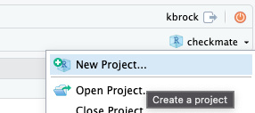
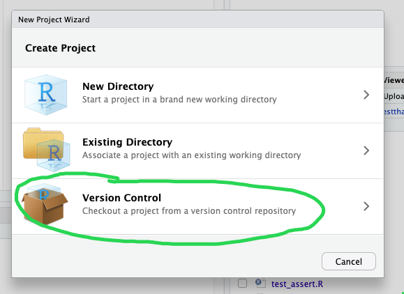
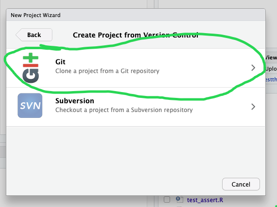

# Validating Code as Author and Reviewer

## About

### Attribution/License

This content is a remix of The Carpentries Incubator lesson [Better Research Software Episode 6](https://carpentries-incubator.github.io/better-research-software/06-code-correctness.html) as well as that lesson's setup released and used under [CC-BY](https://swcarpentry.github.io/shell-novice/LICENSE.html). This lesson was remixed for R by Katrina Brock and the remix is not endorsed by The Carpentries. Summary of changes can be found [here](./remix-summary.md)

### Objectives and Questions

<details> <summary> Learning Objectives </summary>

After completing this episode, participants should be able to:

- Explain why code testing is important and how this improves software quality.
- Describe the different types of software tests (unit tests, integration tests, regression tests).
- Implement unit tests to verify that function behave as expected using the Python testing framework `pytest`.
- Interpret the output from `pytest` to identify which functions are not behaving as expected.
- Write tests using typical values, edge cases and invalid inputs to ensure that the code can handle extreme values and invalid inputs appropriately.
- Evaluate code coverage to identify how much of the codebase is being tested and identify areas that need further tests.

</details>

<details> <summary> Questions </summary>

- How can we verify that our code is correct?
- How can we automate our software tests?
- What makes a "good" test?
- Which parts of our code should we prioritise for testing?

</details>

## Getting Started

### RStudio Access

If you are remote and don't have vpn access you can download the lesson materials via this link:

[https://github.com/livingingroups/eas-coding-workshops/archive/refs/heads/main.zip](https://github.com/livingingroups/eas-coding-workshops/archive/refs/heads/main.zip)

### Clone repo

In RStudio in the top right next to your project name. Click the dropdown arrow and select "New Project..".



Then select "From Version Control".



Then select "Git".



Then paste in this URL: `git@github.com:livingingroups/eas-coding-workshops.git` and click "Create Project". No need to change the "Project directory name".


### Set up R environment

- Install tinytest, jsonlite, data.table. In the R console.
  ```r
  install.packages(c('tinytest', 'jsonlite', 'data.table'))
  ```
-  Set your working directory to `20251124-validating`.
  ```r
  setwd("20251124-validating")
  ```
-  (optional but recommended) Tools\>Global Options\>Code\>Saving\>Autosave then check the box "Automatically save when editor loses focus"


### Scenario

Today, we are imagining that a colleague has given us their data analysis script and asked for our help
making sure it's working properly. You can find the script in `01-orig-code/eva_data_analysis.R`.
The accompanying data is in `data/eva-data.json`.


This JSON file called `data/eva-data.json` - a snippet of which is shown below - with data on extra-vehicular activities 
(EVAs, i.e. spacewalks) undertaken by astronauts and cosmonauts from 1965 to 2013 (data provided by NASA via its [Open Data Portal](https://data.nasa.gov/Raw-Data/Extra-vehicular-Activity-EVA-US-and-Russia/9kcy-zwvn/about_data)).
  ```json
  [{"eva": "1", "country": "USA", "crew": "Ed White;", "vehicle": "Gemini IV", "date": "1965-06-03T00:00:00.000", "duration": "0:36", "purpose": "First U.S. EVA. Used HHMU and took  photos.  Gas flow cooling of 25ft umbilical overwhelmed by vehicle ingress work and helmet fogged.  Lost overglove.  Jettisoned thermal gloves and helmet sun visor"}
  ,{"eva": "2", "country": "USA", "crew": "David Scott;", "vehicle": "Gemini VIII", "duration": "0:00", "purpose": "HHMU EVA cancelled before starting by stuck on vehicle thruster that ended mission early"}
  ,{"eva": "3", "country": "USA", "crew": "Eugene Cernan;", "vehicle": "Gemini IX-A", "date": "1966-06-05T00:00:00.000", "duration": "2:07", "purpose": "Inadequate restraints, stiff 25ft umbilical and high workloads exceeded suit vent loop cooling capacity and caused fogging.  Demo called off of tethered astronaut maneuvering unit"}
  ...
  ```
2. A R script called `01-orig/eva_data_analysis.R` containing some analysis code.

  ```r
  library(jsonlite)
  library(data.table) # used for rbindlist

  # Define Params

  input_file <- 'data/eva-data.json'
  output_csv <- 'results/eva_data.csv'
  plot_file <- 'results/plot.png'

  print("--START--")

  # Read in Data ----
  # Read the data from JSON file
  print(paste("Reading JSON file", input_file))

  eva_list <- jsonlite::read_json(input_file)
  eva_data <- rbindlist(eva_list, use.names = TRUE, fill = TRUE)
  eva_data$eva <- as.numeric(eva_data$eva
  ```

  The code in the R script does some common research tasks:

  * Reads in the data from the JSON file
  * Changes the data from one data format to another and saves to a file in the new format (CSV)
  * Performs some calculations to generate summary statistics about the data
  * Makes a plot to visualise the data

:::::: challenge

### Read and understand data and code

Individually inspect the code and try and see if you can understand what the code is doing and how it is organised.

- Can you understand the code? Does it make sense to you?
- Is there anything that makes it particularly easy or hard to read? 
- Do any questions about the script come up to you that you read it?


## Informal testing

### Interactive testing a script

How should we test our code? One approach is run the code line by line in the R console - *different from a command line terminal* - which allows you to interact with the R interpreter more directly.
From the R console we can then run one piece of code at a time and check that they behave as expected.

For example, after running the lines that read in the json file and create the data frame,
we can check if it has the number of rows and columns we expect.

```r
eva_list <- jsonlite::read_json(input_file)
eva_data <- rbindlist(eva_list, use.names = TRUE, fill = TRUE
```

Looking at the `eva-data.json` file, we can see it has one entry per line, and scroll down and see it has 275 lines.
We can check that `eva_list` has this 275 elements and `eva_data` has 175 rows:

```r
> length(eva_list)
[1] 375
> nrow(eva_data)
[1] 375
```

We can also see from the json file, that the fields are `eva`, `country`, `crew`, `vehicle`, `date`, `duration`, and `purpose`.
We can validate that these are the column names of our dataframe:

```r
> colnames(eva_data)
[1] "eva"      "country"  "crew"     "vehicle"  "date"    
[6] "duration" "purpose" 
```

## Isolating code for easier testing

Today, we're going to focus on the analysis section of this script:

```r
# Analysis ----
# Sort dataframe by date ready to be plotted (date values are on x-axis)
eva_data <- eva_data[order(eva_data$date), ]

# Add duration and cum duration in minutes
hours_minutes <- strsplit(eva_data$duration, ":") # results in list of length 2 vectors
for(i in seq_along(hours_minutes)) {
  eva_data[i, 'duration_hours'] <- as.numeric(hours_minutes[[i]][1]) + as.numeric(hours_minutes[[i]][2]) / 6
}

eva_data[["cumulative_time_min"]] <- cumsum(eva_data[["duration_hours"]])
eva_data$cumulative_time <- cumsum(eva_data$duration_hours)
```

::::::::::::::: challenge

1. What is this section fo the script trying to do?
2. What columns of `eva_data` is it taking as input?
3. What columns of `eva_data` is it writing as an output?

:::::: solution

1. It's trying to take the string duration `HH:MM` e.g. `"10:30"` and covert it to a duration in minutes e.g. `10.5`.
  Then, take the cumulative sum.
2. It's using the `date` column to sort and the `duration` column.
3. it's writing `duration_hours` and `cumulative_time`
:::::::::::::::

If we wanted to interactively test this section we might try defining different values for `eva$duration`,
running this section, and then examining the output, but that might get tricky to keep track of what's what.
Instead, we'll isolate the logic we want to test. We'll focus on the part where we're converting the `"HH:MM"`
string to a number.

As input to our code/function we are testing, we typically use some input values for which we know what the correct return value should be.


```r
text_to_duration <- function(duration) {
  # Add duration and cum duration in minutes
  hours_minutes <- strsplit(duration, ":") # results in list of length 2 vectors
  duration_hours <- numeric(length(duration))
  for(i in seq_along(hours_minutes)) {
    duration_hours <- as.numeric(hours_minutes[[i]][1]) + as.numeric(hours_minutes[[i]][2]) / 6
  }
  return(duration_hours)
}

# Analysis ----
# Sort dataframe by date ready to be plotted (date values are on x-axis)
eva_data <- eva_data[order(eva_data$date), ]

# Add duration and cum duration in minutes
eva_data[i, 'duration_hours'] <- calculate_duration_hours(eva_data$duration)

eva_data[["cumulative_time_min"]] <- cumsum(eva_data[["duration_hours"]])
eva_data$cumulative_time <- cumsum(eva_data$duration_hours)
```

### Interactively Testing a Function

Now we can run tests on just this piece of code:

Let's do this for our `text_to_duration` function.
Recall that the `text_to_duration` function converts a spacewalk duration stored as a string
in format "HH:MM" to a duration in hours - e.g. duration `01:15` (1 hour and 15 minutes) should return a numerical value of `1.25`.

You can type your R code into the Console tab in RStudio.
It will interactively run your code and return and print results.
We could copy and paste the code of our `text_to_duration` function.
Another way to pull in our function definitions is to `source` the file.

```r
text_to_duration <- function(duration) {
  ...
}
text_to_duration("10:00")
```

```output
[1] 10
```

So, we have invoked our function with the value "10:00" and it returned the value "10" as expected.

We can then further explore the behaviour of our function by running:

```r
> text_to_duration("00:00")
[1] 0.0
```

This all seems correct so far.

Testing code in this "informal" way in an important process to go through as we draft our code for the first time.

However, there are some serious drawbacks to this approach if used as our only form of testing.

:::::: challenge

### What are the limitations of informally testing code? (5 minutes)

Think about the questions below. Your instructors may ask you to share
your answers in a shared notes document and/or discuss them with other
participants.

- Why might we choose to test our code informally?
- What are the limitations of relying solely on informal tests to
  verify that a piece of code is behaving as expected?

::: solution

It can be tempting to test our code informally because this approach:

- is quick and easy
- provides immediate feedback

However, there are limitations to this approach:

- Working interactively is error prone
- We must reload our function in console each time we change our code
- We must repeat our tests every time we update our code which is time consuming
- We must rely on memory to keep track of how we have tested our code, e.g. what input values we tried
- We must rely on memory to keep track of which functions have been tested and which have not 
(informal testing may work well on smaller pieces of code but it becomes unpractical for a large codebase)
- Once we close the console, we lose all the test scenarios we have tried
:::
::::::

## Formal testing

We can overcome some of these limitations by formalising our testing process. 
A formal approach to testing our code is to write dedicated test functions to check it. 
These test functions:

- Run the function we want to test - the target function with known inputs
- Compare the output to known, valid results
- Raise an error if the function’s actual output does not match the expected output
- Are recorded in a test script that can be re-run on demand.

Let’s explore this process by writing some formal tests for our `text_to_duration` function. 

First, let's move the function we want to test into its own file.

`my_functions.R`

```r
text_to_duration <- function(duration) {
  ...
}
```

We can source this file at the top of our analysis script.

```r
library(jsonlite)
library(data.table) # used for rbindlist
source("my_functions.R")

# Define Params

input_file <- 'data/eva-data.json'
...
```

Create a new R file `test_code.R` in the root of our project directory to store our tests.

Like before in the R Console, we need to source our function `text_to_duration` into our test script. 
That function is now in `my_functions.R`
Then, we add our first test function:

```r
source("my_functions.R")
input_value <- "10:00"
test_result <- text_to_duration("10:00") == 10
print(paste("text_to_duration('10:00') == 10?", test_result))
```

We can now source our test script in the console:

```r
> source("test_code.R")
```
or run it in the Terminal.

```bash
$ Rscript test_code.R 
```

This test checks that when we apply `text_to_duration` to input value `10:00`, the output matches the expected value
of `10`.

In this example, we use a print statement to report whether the actual output from `text_to_duration` meets our 
expectations.

However, this does not meet our requirement to “Raise an error if the function’s output does not match the expected 
output” and means that we must carefully read our test function’s output to identify whether it has failed.

To ensure that our code raises an error if the function’s output does not match the expected output, we use R's `stopifnot` statement. This function does nothing if passed in `TRUE` and raises an error if passed in `FALSE`.

Let's rewrite our test with `stopifnot`:

```r

source("my_functions.R")
stopifnot(text_to_duration("10:00") == 10)
```

Notice that when we run `test_text_to_duration_integer()`, nothing
happens - there is no output. That is because our function is working
correctly and returning the expected value of 10.

Let's add another test to check what happens when duration is not an integer number and if our function can handle 
durations with a non-zero minute component, and rerun our test code.

```r
source("my_functions.R")

# Test fraction of an hour duration from text
stopifnot(text_to_duration("10:15") == 10.25)

# Test whole hour duration from text
stopifnot(text_to_duration("10:00") == 10)
```

``` error
 > source("test_code.R")
Error: text_to_duration("10:15") == 10.25 is not TRUE
```

Our `stopifnot` function has raised an error - a clear signal that there is a problem in our code that we
need to fix.

We know that duration `10:15` should be converted to number `10.25`.
What is wrong with our code?
If we look at our `text_to_duration` function, we may identify the following line of our code as problematic:

```r
text_to_duration <- function(duration) {
  ...
  duration_hours <- as.numeric(hours_minutes[[i]][1]) + as.numeric(hours_minutes[[i]][2]) / 6
  ...
}
```

You may notice that we have introduced a bug in one of the earlier episodes when we refactored the code - the minutes component should have been divided by 60 and not 6.

This is quite *critical* - our code was running (seemingly) OK (i.e. it did not fail) and was producing the graph which we 
could not tell was wrong just by looking at it as this was a subtle bug.
We were only able to uncover this bug **by properly testing our code**.

Let's fix the problematic line and rerun out tests. 

```r
...
  duration_hours <- as.numeric(hours_minutes[[i]][1]) + as.numeric(hours_minutes[[i]][2]) / 60
...
```

This time our tests run without problem.

Should we add more tests or the tests we have so far are enough? 
What happens if our duration value is `10:20` (ten hours and 20 minutes) and our result is not a rational floating 
point number (like `10.25`) but an irrational number such as `10.333333333`? 
Let's tests for this.

```r
source("my_functions.R")
stopifnot(text_to_duration("10:15") == 10.25)


# Test 1/3 hour duration from text
stopifnot(text_to_duration("10:20") == 10.33333)
# Test 1/4 hour duration from text
stopifnot(text_to_duration("10:15") == 10.25)
# Test whole hour duration from text
stopifnot(text_to_duration("10:00") == 10)
```

```error
>source("test_code.R")
text_to_duration("10:20") == 10.333333 is not TRUE
```

Our test is failing again - what is wrong now?

On computer systems, representation of irrational numbers is typically not exact as they do not have an exact binary 
representation.
For this reason, we cannot use a simple double equals sign (`==`) to compare the equality of floating point numbers. 
Instead, we check that our floating point numbers are equal within a very small tolerance (e.g. 1e-5).
Hence, our code should look like:

```r
...
stopifnot(abs(text_to_duration("10:20") - 10.333333) < 1e-5)
...
```

You may have noticed that some code is repeated with each test.
Even worse our test script stopped after the first test failure and none of the tests after that 
were run.
To run our remaining tests we would have to manually comment out our failing test and re-run the test script. 
Additionally, even though we have comments in our code describing each tests,
That description doesn't make its way into the error message.
As our code base grows, testing in this way becomes cumbersome and error-prone. 
These limitations can be overcome by automating our tests using a **testing framework**.

## Testing frameworks

Testing frameworks can automatically find all the tests in our code base, run all of them (so we do not have to invoke 
them explicitly or, even worse, forget to invoke them), and present the test results as a readable summary.

We will use the testing framework `tinytest` along.

Let’s set up our tests to work well with `tinytest`

We can replace our base R `stopifnot` with `expect_true` which tells tinytest
which errors are the result of the thing we are trying to test not working,
rather than the result of other things not working.

```r
library(tinytest)
source("my_functions.R")

expect_true(
  abs(text_to_duration("10:20") - 10.333333) < 1e-5,
  info = "Test 1/3 hour duration from text"
)
expect_true(
  text_to_duration("10:15") == 10.25,
  info = "Test 1/4 hour duration from text"
)
expect_true(
  text_to_duration("10:00") == 10,
  info = "Test whole hour duration from text"
)
```

If we run this line by line, we'll see something like:

```output
----- PASSED      : <-->
 call| expect_true(abs(text_to_duration("10:20") - 10.333333) < 1e-05, 
 call| info = "Test 1/3 hour duration from text")
 info| Test 1/3 hour duration from text 
```

If want to run everything now, instead of `source`ing the file, we can
run a testing function:

```r
> tinytest::run_test_file("test_code.R")

```
tinytest::run_test_file("02-3file/test_code.R")

```output
test_code.R...................    3 tests OK 25ms
All ok, 3 results (25ms)
```

We can also simplify our `expect_` statements by using `expect_identical` (exact)
and `expect_equal` (approximate).

```R
library(tinytest)
source("my_functions.R")

expect_equal(
  text_to_duration("10:20"),
  10.333333,
  info = "Test that 1/3 hour duration from text"
)
expect_identical(
  text_to_duration("10:15"),
  10.25,
  info = "Test that 1/4 hour duration from text"
)
expect_identical(
  text_to_duration("10:00"),
  10,
  info = "Test that whole hour duration from text"
)
```

Writing our tests this way highlights the key idea that each test should compare the actual results returned by our 
function with expected values.

Similarly, writing titles for our tests that complete the sentence "Test that ..." helps us to understand 
what each test is doing and why it is needed.

Rerunning our tests, they are still passing.

```r
> tinytest::run_test_file('test_code.R')
```

```error
test_code.R...................    3 tests 1 fails 28ms
----- FAILED[data]: test_code.R<22--26>
 call| expect_equal(text_to_duration("10:20"), 10.333333, info = "Test 1/3 hour duration from text")
 diff| Expected '10.333333', got '10.3333333333333'
 info| Test 1/3 hour duration from text
 
Showing 1 out of 3 results: 1 fails, 2 passes (28ms)
```

Uh-oh now one of the tests is failing, but you can see that the error is explained much more clearly
than with our `stopifnot` version.

The error is happening because even though
`tinytest::expect_equal` doesn't require the argument to be identical.
The differences it allows (`tolerance`) is less than what
we allowed. In the help page of `tinytest::expect_equal`,
we can see that the default tolarance is `sqrt(.Machine$double.eps)`.

We can check what that is four our particular machine:

```r
> sqrt(.Machine$double.eps)
[1] 1.490116e-08
```

In your previous version, we were using `1e-5`.

This can be resolved in one of two ways:

1) Increase the tolerance in expect equal.
 ```r
  expect_equal(text_to_duration("10:20"), 10.333333, tolerance = 1e-5)
  ```

2) Add more trailing `3`s to the expected value. (There need to be at least 7.)
  ```r
  expect_equal(text_to_duration("10:20"), 10.3333333) # 7 trailing 3s in 10.333333

  ```


Let's now reintroduce our old bug in function `text_to_duration` that affects 
the durations with a non-zero minute component like "10:20" but not those that are whole hours, e.g. "10:00":

```r
  ...
  duration_hours <- as.numeric(hours_minutes[[i]][1]) + as.numeric(hours_minutes[[i]][2]) / 6
  ...
```

Let's re-run our tests with `tinytest`:

```r
> tinytest::run_test_file("test_code.R")
```

```error
test_code.R...................    3 tests 2 fails 24ms
----- FAILED[data]: test_code.R<22--27>
 call| expect_equal(text_to_duration("10:20"), 10.333333, tolerance = 1e-05, 
 call| -->    info = "Test 1/3 hour duration from text")
 diff| Expected '10.333333', got '13.3333333333333'
 info| Test 1/3 hour duration from text
 ----- FAILED[data]: test_code.R<28--32>
 call| expect_identical(text_to_duration("10:15"), 10.25, info = "Test 1/4 hour duration from text")
 diff| Expected '10.25', got '12.5'
 info| Test 1/4 hour duration from text
 
Showing 2 out of 3 results: 2 fails, 1 passes (24ms)
```

::::challenge

- Why are there two places where a summary of the results are written? `3 tests 2 fails 24ms` and `2 fails, 1 passes (24ms)`
- Why are only 2 out of the 3 results shown? How does this compare to what it looks like running line by line?
- What does the `<22--27>` section mean?
- What do the `call`, `diff`, and `info` sections mean?

::: solution
From the above output, we notice that: 

- For each testing file, there is a summary of how many successes and failures occurred in that file. (Since we currently only have one testing file, the file summary and the overall.) Overall summary is at the end.
summary contain identical info.)
- Lists the failures, with the file (`test_code.R`), line numbers of the test (`<22-27>`).
- The `call` section shows failing test (the code itself). The `diff` section,
  shows the two values that 

:::
::::

Let's fix our bug once again, and rerun our tests using `testthat`.

```output
══ Testing test_code.R ══════════════════════════════════════════════════════════════════════════════════════════
[ FAIL 0 | WARN 0 | SKIP 0 | PASS 2 ] Done!
```

This time, all out tests passed.

::: challenge

### Interpreting tinytest output

A colleague has asked you to conduct a pre-publication review of their code which analyses time spent in 
space by various individual astronauts.

You tested their code using `tinytest`, and got the following output.
Inspect it and answer the questions below.

#### Example `pytest` output

``` output
2ms
1ms
----- FAILED[data]: test_analyse.R<12--12>
 call| expect_equal(calculate_total_duration(c(10, 15, 20, 5)), 50/60)
 diff| Expected '0.833333333333333', got '8.33333333333333'
 ----- FAILED[xcpt]: test_analyse.R<13--15>
 call| expect_silent(expect_equal(calculate_mean_duration(c(10, 15, 
 call| -->    20, 5)), 12.5/60))
 diff| Execution was not silent. An error was thrown with message
 diff| 'could not find function "lenght"'
 
Showing 2 out of 9 results: 2 fails, 7 passes (5ms))
```

a.  How many tests has our colleague included in the test suite?
b.  How many tests failed?
c.  Which file(s) are the failing tests in?
d.  Why did "test_total_duration" fail?
e.  Why did "test_mean_duration" fail?

::: solution
a.  9 tests were detected in the test suite
b.  2 tests failed
c.  The failures are in `test_analysis.R`
d.  `test_total_duration` failed because the calculated total duration
    differs from the expected value by a factor of 10 i.e. 
    `calculate_total_duration(c(10, 15, 20, 5))` was not equal to `50/60`
e.  `test_mean_duration` failed because there is a syntax error in
    `calculate_mean_duration`. Our colleague has used the command
    `lenght` (not an R command) instead of `length`.
    As a result, running the function raises an error rather than returning a calculated value causing the function to be interrupted prematurely and the test to fail.
:::
:::

## Test design

We now have the tools in place to automatically run tests. 
However, that alone is not enough to properly test code.
We will now look into what makes a good test suite and good practices for testing code.

Let’s start by considering the following scenario. 
A collaborator on our project has sent us the following code which adds a new column called `crew_size` 
to our data containing the number of astronauts participating in any given spacewalk. 
How do we know that it works as intended and that it will not break the rest of our code?
For this, we need to write a test suite with a comprehensive coverage of the new code.
 
```r
#' Calculate the size of the crew for a single crew entry
#'
#' @param crew (character) The text entry in the crew column containing a list of crew member names
#'
#' @return (numeric) The crew size
calculate_crew_size <- function(crew) {
  size <- length(unlist(strsplit(crew, ";")))
  if (size == 0) return(NULL)
  size
```

### Writing good tests

The aim of writing good tests is to verify that each of our functions behaves as expected with the full range of inputs 
that it might encounter.
It is helpful to consider each argument of a function in turn and identify the range of typical values it can take.
Once we have identified this typical range or ranges (where a function takes more than one argument), we should:

- Test all values at the edge of the range
- Test at least one interior point
- Test invalid values

Let's have a look at the `calculate_crew_size` function from our colleague's new code and write some tests for it.

:::::: challenge

### Unit tests for calculate_crew_size

Implement unit tests for the `calculate_crew_size` function. 
Cover typical cases and edge cases.

Hint - use the following template when writing tests:

```r
# Typical value 1
actual_result <- _______________ 
expected_result <- _______________ 
expect________________(actual_result, expected_result) 

# Typical value 2
actual_result <- _______________
expected_result <- _______________ 
expect________________(actual_result, expected_result) 

::: solution

We can add the following test functions to out test suite.

```r
# Typical values
actual_result <- calculate_crew_size("Valentina Tereshkova;")
expected_result <- 1L
expect_identical(actual_result, expected_result)

actual_result <- calculate_crew_size("Judith Resnik; Sally Ride;")
expected_result <- 2L
expect_identical(actual_result, expected_result)

# Edge cases
actual_result <- calculate_crew_size("")
expect_null(actual_result)

```

:: instructor
`1L`/`2L` is needed if using `expect_identical` because "identical" means same datatype as well as same value.
`length` returns an integer. `1`, `2`, etc. by default is numeric (float). `1L` indicates we want an integer.

```output
> str(1L)
 int 1

> str(1)
 num 1

> str(length('a'))
 int 1
```


::

Let's run out tests:

```r
> testthat::test_file("test_code_06.R")
```

:::
::::::

## Test Suite Design

A collection of tests is called "Test Suite".
When writing tests for a pieces of software,
in addition to looking at the range of inputs we're 
running for individual tests, we want to also make sure
our tests as a whole do a good job of testing our program is a whole

### Types of software tests

To check our software at different levels of granularity. We can use different types of tests:

- **Unit tests** focus on testing individual functions in
    isolation. They ensure that each small part of the software performs
    as intended. By verifying the correctness of these individual units,
    we can catch errors early in the development process.

- **Integration tests** check how different parts
    of the code e.g. functions work together.

- **Regression tests** are used to ensure that new
    changes or updates to the codebase do not adversely affect the
    existing functionality. They involve checking whether a program or
    part of a program still generates the same results after changes
    have been made.

- **End-to-end** tests are a special type of integration testing which
    checks that a program as a whole behaves as expected.
    
:::: callout

When you hear the words "Regression test" the concept of statisical
regression may come to mind. This is not the most helpful in understanding
what this type of test is. Instead, think about "to regress" as the opposite of "to progress" i.e. "to regress is to go backward.
Therefore, Regression tests check that you don't inadverently "go backward" ie brake things that were working before when 
you are trying to improve your software,.

::::


:::: challenge

Which of these categories do the tests we've written today fall into?

:: solution

These are "Unit tests" because the test a small piece of software for correctness.
They can also be considered "Regression tests" because
they will protect us against possibly breaking those bits of code in the future.

::
::::

:::: challenge

What would it mean to run an "end-to-end" test on the pipeline that we've been working on?

:: solution

It would mean writing tests that check the whole script.
First, we would need to wrap the whole script in a function:

```r
library(jsonlite)
library(data.table) # used for rbindlist

eva_analysis <- function(input_file, output_csv, plot_file)

  print("--START--")

  # Read in Data ----
  # Read the data from JSON file
  print(paste("Reading JSON file", input_file))

  eva_list <- jsonlite::read_json(input_file)
  eva_data <- rbindlist(eva_list, use.names = TRUE, fill = TRUE)
  ...
```

Then, we'd want to craft some test inputs and outputs
that are simpler than our target data.

```{r}
jsonlite::write_json('test_input.json', list(
  list(
    eva = 1,
    name = "Jo Schmo",
    ...
    date = "01-01-2024",
    duration = "1:00"
  ),
  list(
    eva = 2,
    name = "Janey",
    ...
    date = "01-02-2025",
    duration = "0:30"
  )
))

write.csv(
  'reference_output.csv'
  eva = c(1,2),
  name = c("Joe Schmo", "Janey"),
  ...
  date = c("01-01-2025","01-02-2025"),
  duration = c("1:00", "0:30")
)

plot(
  x = c(2024, 2025),
  y = c(60, 90),
  xlab = "Year",
  ylab= "Minutes",
  main = "Total time spent in space to date"
)
reference_plot <- recordPlot()

# Note that the format of `recordPlot()` is not guarenteed to stay the same accross R versions
# Therefore, the reference rds file must be created with the same R 
# version as the plot under test. Probably easiest to create in the same session
saveRDS('reference_plot.rds')
```

Then, we would write some expectations for the outputs
of this function as a whole:

```r
eva_analysis('test_input.json', 'test_output.csv', 'test_plot.png')

actual_plot <- recordPlot()

expect_equal(
  read.csv("test_output.csv"),
  read.csv("reference_ouput.csv")
)

# This may be too stringent.
# you might want to just test some attributes
# of the plot object.
expect_equal_to_reference(
  actual_plot,
  "reference_plot.rds"
)

```

::
::::


## Continuous Integration for automated testing

Continuous Integration (CI) services provide the infrastructure to automatically run every test function in 
the test code suite every time changes are pushed to a remote repository.
There is an [extra episode on configuring CI for automated tests on GitHub](../learners/ci-for-testing.md)
for some additional reading.

## Why use software testing?

Including testing in our research workflow helps us to produce **better software** and conduct **better research**:

- Software testing can help us be more productive as it helps us to identify and fix problems with our code early and
  quickly and allows us to demonstrate to ourselves and others that our
  code does what we claim. More importantly, we can share our tests
  alongside our code, allowing others to verify our software for themselves.
- The act of writing tests encourages to structure our code as individual functions and often results in a more
  **readable**, modular and maintainable codebase that is easier to extend or repurpose.
- Software testing improves the **accessibility** and **reusability** of our code - well-written software tests
  capture the expected behaviour of our code and can be used alongside documentation to help other developers
  quickly make sense of our code. In addition, a well tested codebase allows developers to experiment with new
  features safe in the knowledge that tests will reveal if their changes have broken any existing functionality.
- By demonstrating that our code works as expected and produces accurate results, software testing can give us the confidence to share our code with others.
  Software testing brings peace of mind by providing a
  step-by-step approach that we can apply to verify that our code is
  correct.

## Summary

During this episode, we have covered how to use software tests to verify
the correctness of our code. We have seen how to write a unit test, how
to manage and run our tests using the `tinytest` framework and how identify
which parts of our code require additional testing using test coverage
reports.

These skills reduce the probability that there will be a mistake in our
code and support reproducible research by giving us the confidence to
engage in open research practices. 
Tests also document the intended behaviour of our code for other developers and mean that we can
experiment with changes to our code knowing that our tests will let us
know if we break any existing functionality. 
In other words, software testing supports the [FAIR software principles][fair-principles-research-software] by making our code more **accessible** and
**reusable**.

::: keypoints

1.  Code testing supports the FAIR principles by improving the
    accessibility and re-usability of research code.
2.  Unit testing is crucial as it ensures each functions works
    correctly.
3.  Using the `pytest` framework, you can write basic unit tests for
    Python functions to verify their correctness.
4.  Identifying and handling edge cases in unit tests is essential to
    ensure your code performs correctly under a variety of conditions.
5.  Test coverage can help you to identify parts of your code that
    require additional testing.

:::